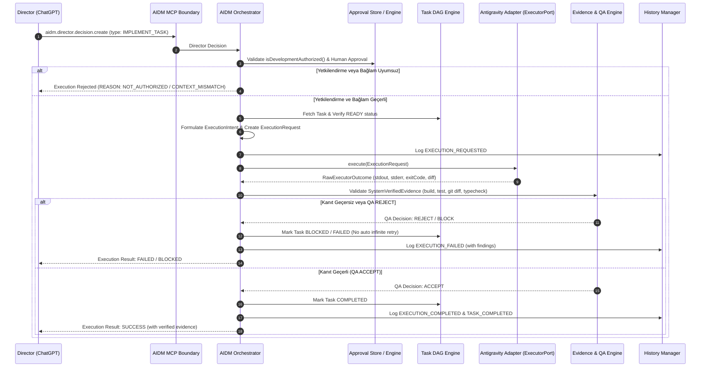
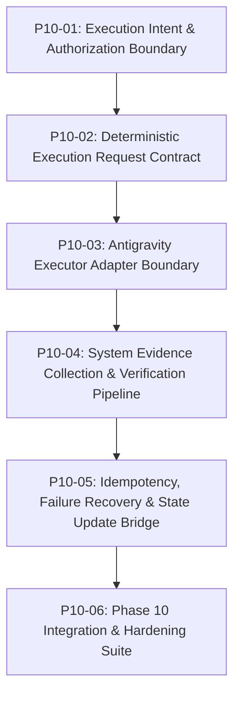

# PHASE 10 — EXECUTION BOUNDARY & ANTIGRAVITY ORCHESTRATION PROTOCOL
## Teknik Tasarım ve Sistem Mimarisi Spesifikasyonu

> **Doküman Türü:** Sistem Mimarisi & Uygulama Öncesi Teknik Spesifikasyon (Design-Only)  
> **Faz:** Phase 10 — Execution Boundary & Antigravity Orchestration Protocol  
> **Referans Commit:** `f6a1dd8227b0b4d1905b52e2c7ccc28f41dc9328` (Kabul edilmiş P9-04)  
> **Durum:** DRAFT — PENDING PRODUCT OWNER APPROVAL  

---

## 1. GİRİŞ VE MEVCUT FAZ 8–9 MİMARİSİNDEN ÇIKARILAN BULGULAR

AIDM sisteminde Phase 1–7 ile temel otonom orkestrasyon ve yürütme temelleri; Phase 8 ile MCP kontrol sınırı ve proje anlama/onay mekanizmaları; Phase 9 ile de harici ChatGPT Director oturumu (`P9-01`), bağlam senkronizasyonu (`P9-02`), tipli karar protokolü (`P9-03`) ve insan/Product Owner onay & resume protokolü (`P9-04`) inşa edilmiştir.

Bu mevcut altyapıdan çıkarılan kritik mimari gerçekler şunlardır:
1. **Otorite Ayrılığı (Separation of Authorities):**
   - **USER / PRODUCT OWNER:** Nihai onay ve yetkilendirme otoritesi (`isDevelopmentAuthorized() === true`).
   - **DIRECTOR (ChatGPT):** Danışman, mimar ve planlayıcıdır; serbest metin veya `DIRECTOR_DECISION` üretir; asla kod yazmaz ve asla doğrudan onay üretemez.
   - **AIDM (Orchestrator):** State, FSM (`DurableStateManager`), Task DAG (`TaskDagEngine`), Policy (`PolicyEngine`) ve History (`HistoryManager`) otoritesidir.
   - **ANTIGRAVITY (Implementer):** Uygulama yürütücüsüdür (`ExecutorPort`); asla otorite kazanmaz, karar vermez, yetki oluşturamaz.
2. **Kriptografik ve Bağlamsal Kilitlenme (Multi-Dimensional Binding):**
   Her operasyon `projectId`, `directorSessionId`, `contextFingerprint`, `understandingRevision` ve `approvalPackageRevision` bileşenlerine deterministik olarak kilitlenmiştir.
3. **Mevcut Yapıtaşları (Reused Foundations):**
   Phase 3'te tasarlanmış `ExecutorPort`, `ExecutorInstruction`, `RawExecutorOutcome`, `NormalizedExecutorResult` ve Phase 4'te tasarlanmış `SystemVerifiedEvidence`, `QAReviewEngine` hazır beklemektedir. Phase 10, bu hazır bileşenleri Phase 9'un Director ve Human Approval sınırlarıyla güvenli bir köprü üzerinden bağlamalıdır.

---

## 2. PHASE 10'UN AMACI VE KAPSAMI

Phase 10'un yegane amacı:
> *"Director tarafından verilen ve gerekli Product Owner onay ve yetkilendirme sınırlarını (`isDevelopmentAuthorized()`) eksiksiz geçen implementation kararlarının, AIDM tarafından kontrollü, deterministik ve idempotency korumalı bir sözleşme ile Antigravity'ye aktarılması; Antigravity'nin ürettiği sonucun kesinlikle 'iddia' olarak değil 'sistem tarafından doğrulanmış kanıt' (System-Verified Evidence) olarak toplanıp QA denetiminden geçirilmesi ve yalnızca bu doğrulama sonucunda AIDM Task DAG / State / History içine işlenmesidir."*

**Önemli Kapsam Sınırı:**
Phase 10 ilk aşamada ucu açık, sonsuz bir otonom loop başlatmaz. Önce tekil görev bazında çalışan deterministik **Execution Boundary** kurulur.

---

## 3. EXECUTION LIFECYCLE (YÜRÜTME YAŞAMDÖNGÜSÜ)



---

## 4. AUTHORITY BOUNDARIES (OTORİTE SINIRLARI)

1. **Director Boundary:** Director yalnızca niyet ve strateji bildirir (`DirectorDecision`). Antigravity'yi doğrudan tetikleyemez.
2. **Approval Boundary:** Human Product Owner onayı olmadan (`isDevelopmentAuthorized() === false`) hiçbir execution request oluşturulamaz.
3. **Execution Boundary:** Antigravity doğrudan çalışma alanındaki dosyaları düzenleyebilir, ancak AIDM veritabanına (`.ai-manager/*`) ve FSM/DAG durumuna asla doğrudan yazamaz.
4. **Evidence Boundary:** Antigravity'nin "işi bitirdim" mesajı bir `AGENT_CLAIM`dir. Görevin tamamlanması için işletim sistemi çıktısı, derleyici ve test motoru tarafından üretilen `SystemVerifiedEvidence` şarttır.

---

## 5. CONTRACTS: EXECUTION REQUEST & RESULT

### A. Execution Request Contract (`aidm.execution.request`)
```typescript
export interface ExecutionRequest {
  readonly requestId: string;              // Deterministic UUID / Hash (Idempotency key)
  readonly projectId: string;              // Canonical project ID
  readonly directorSessionId: string;      // Active Director Session ID
  readonly directorDecisionId: string;     // Triggering Director Decision ID
  readonly taskId: string;                 // Task identifier from Task DAG
  readonly taskRevision: number;           // Monotonic task revision
  readonly contextFingerprint: string;     // Exact snapshot fingerprint
  readonly understandingRevision: number;  // Authoritative understanding baseline
  readonly approvalPackageRevision: number;// Bound human approval revision
  readonly operationType: ExecutorOperationType; // IMPLEMENT_TASK, EXECUTE_TEST, etc.
  readonly instruction: {
    readonly objective: string;
    readonly constraints: readonly string[];
    readonly targetFiles: readonly string[];
    readonly acceptanceCriteria: readonly AcceptanceCriterionSpec[];
  };
  readonly expectedRepositoryState: {
    readonly baseCommit: string;          // Git HEAD commit when request was issued
    readonly isClean: boolean;            // Working tree clean requirement
  };
  readonly executionLimits: {
    readonly timeoutMs: number;
    readonly maxFileModifications: number;
  };
  readonly protocolVersion: 'P10-01';
  readonly schemaVersion: 1;
}
```

### B. Execution Result Contract (`aidm.execution.result`)
```typescript
export interface ExecutionResult {
  readonly requestId: string;
  readonly taskId: string;
  readonly status: 'SUCCESS' | 'FAILED' | 'BLOCKED' | 'TIMED_OUT' | 'SECURITY_REJECTED';
  readonly qaDecision: 'ACCEPT' | 'REJECT' | 'REQUEST_CONTEXT' | 'BLOCK';
  readonly rawOutcome: RawExecutorOutcome;
  readonly verifiedEvidence: readonly SystemVerifiedEvidence[];
  readonly repositoryStateAfter: {
    readonly headCommit: string;
    readonly changedFiles: readonly string[];
    readonly untrackedFiles: readonly string[];
  };
  readonly findings: readonly ReviewFinding[];
  readonly executedAt: string;
  readonly durationMs: number;
}
```

---

## 6. EVIDENCE VALIDATION MODEL (KANIT DOĞRULAMA MOTORU)

Antigravity bir görevi tamamladığını beyan ettiğinde, AIDM arka planda deterministik doğrulama adımlarını işletir:
1. **Git State Inspection:** Değişen dosyaların görev kapsamında izin verilen `targetFiles` listesinde olup olmadığının denetimi (Scope Leak Protection).
2. **Build Verification:** Proje derleme komutunun (`pnpm build` vb.) exit code 0 ile tamamlandığının sistem seviyesinde tespiti.
3. **Typecheck Verification:** Statik tip denetiminin (`tsc --noEmit`) hatasız geçtiğinin doğrulanması.
4. **Test Verification:** Görevin acceptance criteria'sına bağlı birim/entegrasyon testlerinin başarıyla geçtiğinin ve gerileme (regression) olmadığının teyidi.
5. **Sanitization:** Log ve çıktılardan tüm gizli anahtarların (API keys, tokens) arındırılması.

---

## 7. IDEMPOTENCY & REPLAY KORUMASI

1. **Tekil `requestId`:** Her execution talebi, `SHA256(projectId + directorDecisionId + taskId + contextFingerprint)` üzerinden deterministik olarak türetilir.
2. **Execution Store:** Daha önce tamamlanmış veya halihazırda yürütülen bir `requestId` tekrar gelirse:
   - Eğer halihazırda yürütülüyorsa: `DUPLICATE_EXECUTION_IN_PROGRESS` reddi.
   - Eğer başarıyla tamamlanmışsa: Önbelleğe alınmış doğrulanmış sonuç döner (`ALREADY_COMPLETED`), yeniden Antigravity tetiklenmez.
3. **Stale Fingerprint Rejection:** Kod tabanı veya context snapshot değiştiğinde eski `requestId` ve sonuçlar geçersiz (STALE) ilan edilir.

---

## 8. FAILURE & RECOVERY MODELİ (HATA VE KURTARMA)

1. **Temel Kural: `FAILURE ≠ RETRY` ve `FAILURE ≠ SUCCESS`:**
   - Bir execution başarısız olduğunda sistem körlemesine (blind retry) döngüye girmez.
   - Her başarısızlık `HistoryManager`'a audit kaydı olarak işlenir ve hata analizi (`ReviewFinding`) üretilir.
2. **Max Attempts Sınırı:** Bir görev için deneme sayısı (attempt counter) aşılırsa görev `BLOCKED` durumuna geçer ve `REQUEST_HUMAN` durumuna düşer.
3. **Rollback Güvencesi:** Eğer Antigravity çalışma alanını derlenemez/bozuk bir duruma sokarsa, Phase 6'da geliştirilen `GitCheckpointManager` kullanılarak görev başlangıcındaki `baseCommit` kontrol noktasına atomik rollback yapılabilir.

---

## 9. PHASE 10 GÖREV KIRILIMI (TASK BREAKDOWN)

Phase 10, her biri bağımsız test edilebilir, küçük ve odaklanmış alt görevlere ayrılmıştır:



### Alt Görev Spesifikasyonları:

1. **`TASK-P10-01` — Execution Intent & Authorization Boundary:**
   - **Amaç:** Director'ın `IMPLEMENT_TASK` kararını tipli bir `ExecutionIntent` haline getiren ve bunu Phase 9 `isDevelopmentAuthorized()` ve Human Approval bağlamıyla doğrulayan katman.
   - **Bağımlılık:** `P9-04` (Accepted).
   - **Değişecek Dosyalar:** `packages/core/src/director/execution-intent-types.ts`, `packages/core/src/director/execution-authorizer.ts`.
   - **Acceptance Criteria:** Human approval olmadan niyet doğrulanamaz; context fingerprint veya revizyon uyumsuzluğunda deterministik hata üretilir.

2. **`TASK-P10-02` — Deterministic Execution Request Contract:**
   - **Amaç:** Antigravity'ye aktarılacak olan, `expectedRepositoryState` ve kısıtları içeren deterministik `ExecutionRequest` modeli ve Zod şemalarının oluşturulması.
   - **Bağımlılık:** `TASK-P10-01`.
   - **Değişecek Dosyalar:** `packages/core/src/executor-bridge/execution-request-types.ts`, `packages/core/src/executor-bridge/execution-request-builder.ts`.
   - **Acceptance Criteria:** Task DAG'deki görev parametreleri ve kısıtlar şemaya tam uyar; eksik alanlar reject edilir.

3. **`TASK-P10-03` — Antigravity Executor Adapter Boundary:**
   - **Amaç:** `ExecutorPort` üzerinden Antigravity CLI/subagent yürütme sınırını izole eden, AIDM iç durumuna doğrudan erişimi engelleyen güvenli adaptör katmanı.
   - **Bağımlılık:** `TASK-P10-02`.
   - **Değişecek Dosyalar:** `packages/core/src/executor-bridge/antigravity-adapter.ts`, `packages/core/src/executor-bridge/executor-guard.ts`.
   - **Acceptance Criteria:** Antigravity'ye yalnızca saf instruction verilir; Antigravity state manipüle edemez; timeout ve process izolasyonu sağlanır.

4. **`TASK-P10-04` — System Evidence Collection & Verification Pipeline:**
   - **Amaç:** Antigravity'nin çıktısını `RawExecutorOutcome` olarak alan ve bunu derleme, test, tip kontrolü ve git diff denetiminden geçirerek `SystemVerifiedEvidence` üreten boru hattı.
   - **Bağımlılık:** `TASK-P10-03`.
   - **Değişecek Dosyalar:** `packages/core/src/evidence/execution-evidence-collector.ts`, `packages/core/src/qa-review/execution-qa-bridge.ts`.
   - **Acceptance Criteria:** Salt ajan beyanları (`AGENT_CLAIM`) elenir; derleme veya test hatası olduğunda QA `REJECT` veya `BLOCK` döner.

5. **`TASK-P10-05` — Idempotency, Failure Recovery & State Update Bridge:**
   - **Amaç:** Execution sonuçlarının idempotent kaydedilmesi, mükerrer çağrıların engellenmesi; QA ACCEPT durumunda `TaskDagEngine` üzerinden task durumunun güncellenmesi; hata durumunda rollback seçeneklerinin sunulması.
   - **Bağımlılık:** `TASK-P10-04`.
   - **Değişecek Dosyalar:** `packages/core/src/executor-bridge/execution-store.ts`, `packages/core/src/executor-bridge/execution-recovery-manager.ts`.
   - **Acceptance Criteria:** Replay koruması devrededir; ikinci bir Task DAG veya FSM oluşturulmaz; tüm adımlar `HistoryManager`'a loglanır.

6. **`TASK-P10-06` — Phase 10 Integration & Hardening Suite:**
   - **Amaç:** Uçtan uca Director kararından Antigravity yürütmesine, kanıt doğrulamasına ve task kapanışına kadar tüm zinciri mock/in-memory ortamda sınayan kapsamlı entegrasyon test paketi.
   - **Bağımlılık:** `TASK-P10-01` .. `TASK-P10-05`.
   - **Değişecek Dosyalar:** `packages/core/tests/phase-10-execution-boundary.test.ts`.
   - **Acceptance Criteria:** Tüm senaryolar %100 geçer, regression testleri (P1–P9) bozulmaz.

---

## 10. İLK UYGULANABİLİR GÖREV: `TASK-P10-01`

Phase 10 onaylandığında başlanacak ilk iş:
- **Görev:** `TASK-P10-01: Execution Intent & Authorization Boundary`
- **Önkoşul:** P9-04 (`f6a1dd8227b0b4d1905b52e2c7ccc28f41dc9328`).
- **Kapsam:** Director kararının doğrulanması, Human Product Owner authorization teyidi, session ve fingerprint binding denetimi.
