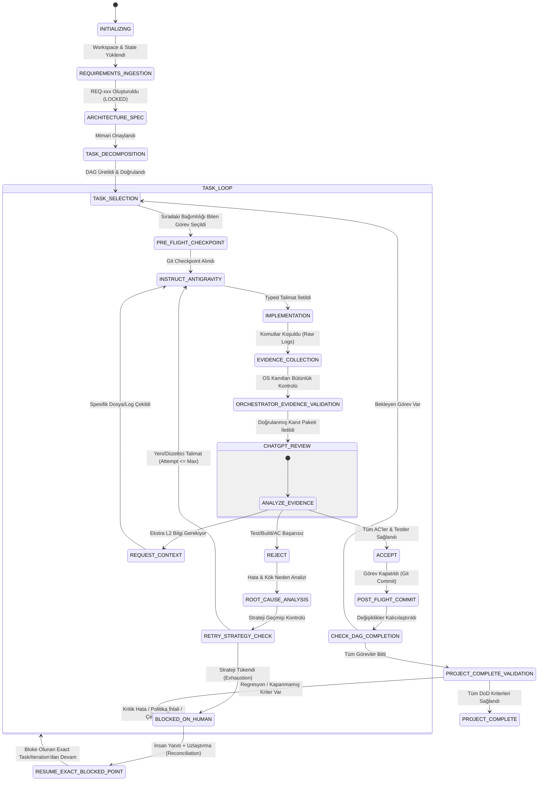
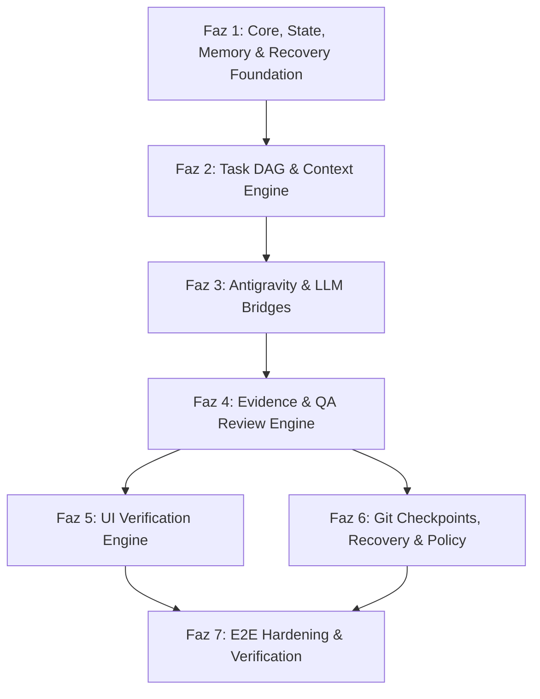
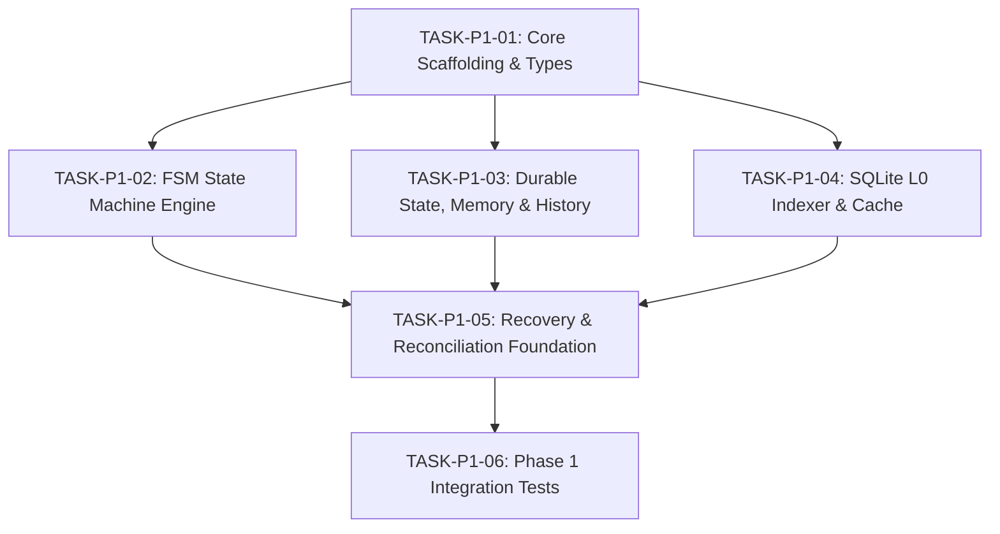

# AI DEVELOPMENT MANAGER — Kapsamlı Teknik Keşif ve Sistem Mimarisi Spesifikasyonu

> **Doküman Türü:** Sistem Mimarisi & Uygulama Öncesi Teknik Spesifikasyon  
> **Sürüm:** 1.2.1-IMPLEMENTATION-READY  
> **Tarih:** 2026-09-21  
> **Durum:** MİMARİ KİLİTLENDİ VE ONAYLANDI (ARCHITECTURE_STATUS: IMPLEMENTATION_READY)  
> **Hedef Sistem:** Genel Amaçlı, Üretim Seviyesinde Otonom Yazılım Geliştirme Yönetim Sistemi (AI Development Manager)

---

## BÖLÜM 0: Ortam ve Yetenek Keşfi (Discovery & Environment Analysis)

Çalışma alanında gerçekleştirilen ortam taraması ve altyapı analizleri neticesinde aşağıdaki teknik bulgular elde edilmiştir:

1. **İşletim Sistemi ve Donanım Altyapısı:**
   * Platform: Linux x86_64 (GitHub Codespaces / Cloud Container ortamı).
   * Yetki Düzeyi: Codespace kullanıcısı sudo yetkilerine sahip, paket yöneticileri ve portlar erişilebilir.

2. **Kullanılabilir Çalışma Zamanları (Runtimes) ve Araçlar:**
   * **Node.js:** `v24.21.0` (LTS üzeri güncel sürüm, yerel `node:sqlite`, ES Modules, Worker Threads, modern async/await desteği).
   * **Paket Yöneticileri:** `npm 11.19.0`, `pnpm 12.3.4` (Monorepo, sembolik bağ ve hızlı kurulum yetenekleri).
   * **Python:** `3.14.2` (Modern async/await ve tip anotasyonları desteği).
   * **Git & Git LFS:** Kurulu, aktif ve yapılandırılmış (`v2.48+`).

3. **Antigravity CLI (`agy`) Yetenekleri ve Köprü Uyumluluğu:**
   * Antigravity CLI binary yolu: `/home/codespace/.local/bin/agy` (v1.2.7).
   * Otonom döngü entegrasyonu için kritik CLI özellikleri:
     * `--dangerously-skip-permissions`: CLI düzeyindeki kullanıcı onay istemlerini atlayarak tam otonom araç çalıştırmayı mümkün kılar. *(Not: Bu bayrak AIDM'nin kendi Policy Engine güvenlik katmanının yerine geçmez; yalnızca CLI düzeyindeki UI blokajını kaldırır).*
     * `--input-format stream-json` / `--output-format stream-json`: Standart girdi/çıktı (stdio) üzerinden satır satır NDJSON mesajlaşması ve structured streaming.
     * `--json-schema`: Yanıtların katı bir JSON şemasına uymasını zorunlu kılma.
     * `--conversation`: Kesintiye uğrayan oturumları conversation ID ile kaldığı yerden sürdürme.
     * `agy mcp`: Yerleşik MCP sunucusu ekleme, kaldırma ve yönetme alt komutları.

4. **Model Context Protocol (MCP) Uyumluluğu:**
   * Antigravity, `~/.gemini/config/mcp_config.json` veya eklenti düzeyinde `stdio` ve `sse` taşıyıcılarını (transports) doğrudan destekler.
   * Model araç çağrıları (tool calls) otomatik olarak keşfedilip agent bağlamına eklenebilir.

5. **Kısıtlar ve Ortam Sınırları:**
   * UI doğrulama için Playwright/Chromium gibi headless tarayıcı motorları global olarak kurulu değildir; ihtiyaç anında projeye özel headless browser ortamı dinamik olarak kurulabilir şekilde tasarlanmalıdır.
   * Workspace temiz başlangıç (greenfield) durumundadır; geçmişten kalan yarım bir çalışma bulunmamaktadır.

---

## 1. Temel Otorite Kuralı ve Önerilen Genel Sistem Mimarisi

Sistemin nihai ve mutlak otoritesi **USER / PRODUCT OWNER**'dır.

### Kesin Otorite ve Yürütme Hiyerarşisi

```
             KULLANICI / PRODUCT OWNER
          (Nihai Otorite: REQ-xxx, DEC-xxx)
                         │
                         ▼
             PROJECT DIRECTOR / CHATGPT
      (Teknik Müdür / Mimar / İnceleme & Kabul Otoritesi)
                         │
                         ▼
                  ORCHESTRATOR CORE
        (ai-development-manager Kontrol Merkezi & FSM)
                         │
                         ▼
                    ANTIGRAVITY
              (Uygulama Mühendisi / İcracı)
```

### Otorite ve Rol Kısıtları:
1. **Kullanıcı Gereksinimleri Değiştirilemez:** Ne ChatGPT ne de Antigravity, kullanıcının açıkça belirttiği bir gereksinimi (`authority: USER`, `status: LOCKED`) kendi tercihiyle veya "daha kolay/iyi" olduğu gerekçesiyle değiştiremez, sessizce yorumlayamaz veya görmezden gelemez.
2. **Antigravity Rol Sınırı:**
   * Antigravity bir uygulama mühendisidir (executor). Bağımsız ürün gereksinimi icat edemez veya mimari tercihini kullanıcı gereksiniminin üzerine koyamaz.
   * Geliştirme sırasında daha iyi bir teknik alternatif tespit ederse, bunu kendiliğinden uygulamak yerine Orchestrator üzerinden ChatGPT'ye öneri olarak raporlayabilir.
   * Teknik gerçeklik ile kullanıcı gereksinimi arasında çözülemez bir çelişki varsa, sistem `BLOCKED_ON_HUMAN` durumuna geçerek kullanıcıya danışmalıdır.
3. **ChatGPT Rol Sınırı:**
   * ChatGPT projenin Teknik Direktörüdür. Yeni kullanıcı gereksinimleri uyduramaz.
   * Belirsizlik durumunda projeyi varsayımlarla saptırmak yerine insana danışma (`REQUEST_HUMAN`) kararı üretir.

---

## 2. Süreç Mimarisi ve Durum Makinesi (Process Architecture & FSM)

Sistem, kesintiye uğrasa dahi kaldığı adımdan kurtarılabilen, doğrulanabilir bir sonlu durum makinesi (Finite State Machine - FSM) modeline göre çalışır:



### Durum Geçiş İlkeleri:
1. **Atlama Yasaktır:** Kanıt (Evidence) toplanmadan ChatGPT incelemesine geçilemez.
2. **Kör Beyan Geçersizdir:** Antigravity'nin "Yaptım/Testler Başarılı" beyanı kabul sebebi olamaz; işletim sistemi seviyesindeki doğrulanmış kanıt (`SYSTEM_VERIFIED_EVIDENCE`) şarttır.
3. **Atomik Durum Yazımı:** Her durum geçişi doğrudan diske atomik olarak yazılır (`durable-state.json` ve `local-runtime.json`).

---

## 3. Bileşen Mimarisi ve Orchestrator Gerçek Kontrol Merkezi

Orchestrator Core, sistemin mutlak kontrol merkezidir. Hiçbir AI aktörü proje durumunu doğrudan değiştiremez.

```text
ai-development-manager/
├── packages/
│   ├── core/                  # FSM, döngü yöneticisi, process daemon, state guard
│   ├── mcp-server/            # Dış istemciler ve IDE'ler için MCP sunucusu
│   ├── bridge-antigravity/    # Antigravity CLI / stdio ve SDK köprüsü (Executor Bridge)
│   ├── bridge-llm/            # LLMProvider soyutlaması ve ChatGPT Director istemcisi
│   ├── context-engine/        # L0/L1/L2 hiyerarşik bağlam motoru ve hash/stale kontrolörü
│   ├── task-engine/           # DAG hesaplayıcı, döngü engelleyici, doğrulayıcı
│   ├── evidence-collector/    # OS komut çıkışları, diff, test, build ve headless UI toplayıcı
│   ├── policy-engine/         # Güvenlik, risk sınıflandırması ve insan eskalasyon motoru
│   ├── git-manager/           # Checkpoint, stash, commit, tag ve rollback yöneticisi
│   └── project-adapters/      # Dilden bağımsız Project, Build, Test ve UI adaptörleri
```

### Orchestrator Sorumlulukları:
* **Task Lifecycle & FSM:** Görevlerin sıralanması, kilitlenmesi ve yürütülmesi.
* **State Transition Yetkisi:** Tek meşru durum güncelleyicisidir. AI modelleri durum talep eder (`REQUEST`), Orchestrator doğrular ve uygular.
* **Evidence Doğrulama:** Antigravity'nin çalıştırdığı komutların exit code, stdout/stderr, git diff ve dosya hash'lerini doğrular.
* **Policy Engine:** Tehlikeli komutları (`rm -rf`, force push vb.) filtreler ve engeller.
* **Kurtarma ve Eşitleme:** Kesinti sonrası gerçek dosya sistemiyle durum tablosunu uzlaştırır.

---

## 4. MCP (Model Context Protocol) Mimarisi

MCP, dış dünya ve aktörler arasındaki standart JSON-RPC entegrasyon protokolüdür:

### A. Orchestrator MCP Sunucu Araçları (Exposed Tools)

| Araç Adı | Parametreler | Açıklama |
| :--- | :--- | :--- |
| `aidm_get_project_state` | `{ project_id }` | Aktif görev, durum özeti ve L0/L1 sistem bilgisini döndürür. |
| `aidm_submit_requirements` | `{ requirements: [...] }` | Kullanıcı gereksinimlerini REQ-xxx olarak kilitler. |
| `aidm_submit_decision` | `{ decision_id, decision, authority }` | Mimari kararları DEC-xxx olarak kaydeder. |
| `aidm_create_task_graph` | `{ tasks: [...] }` | DAG görev çizgesini doğrular ve yükler. |
| `aidm_request_context` | `{ level: "L1"|"L2", paths: [...] }` | Talep üzerine spesifik bağlam veya dosya çeker. |
| `aidm_submit_review` | `{ task_id, decision: "ACCEPT"|"REJECT", feedback }` | ChatGPT'nin inceleme kararını işler. |
| `aidm_escalate_human` | `{ reason, blocking_issue, proposed_options }` | Süreci durdurup insandan onay/cevap ister. |

---

## 5. ChatGPT ↔ Orchestrator ↔ Antigravity İletişim Protokolü

İletişim, serbest metin yerine çift doğrulamalı typed JSON protokolüyle yürütülür:

```
ChatGPT (Director)
       │  [Director Decision / Instruction]
       ▼
Orchestrator Core (Validation Gate)
       │  [Validated Task Instruction]
       ▼
Antigravity (Executor)
       │  [Raw Execution Data]
       ▼
Orchestrator Core (Evidence Validation)
       │  [SYSTEM_VERIFIED_EVIDENCE Package]
       ▼
ChatGPT (Director Review)
       │  [Review Decision: ACCEPT / REJECT / BLOCK]
       ▼
Orchestrator Core (State Transition Execution)
```

### Kanıt Bütünlüğü Ayrımı: `AGENT_CLAIM` vs `SYSTEM_VERIFIED_EVIDENCE`
Antigravity'nin raporu iki ayrık alana bölünür:
* **`agent_claim`:** Ajanın kendi çıkarımı veya özeti (Örn: *"JWT servisi güncellendi ve testler başarıyla geçti."*). Bu alan asla tek başına kabul gerekçesi olamaz.
* **`system_verified_evidence`:** Doğrudan işletim sisteminden, Git'ten ve test çalıştırıcısından toplanan doğrulanabilir veriler:
  * `command`: Çalıştırılan tam terminal komutu.
  * `exit_code`: İşletim sistemi çıkış kodu (0 = Başarılı).
  * `stdout_tail` / `stderr`: Ham terminal çıktıları.
  * `working_directory`: Komutun çalıştığı mutlak dizin.
  * `execution_time_ms`: Çalışma süresi.
  * `git_head_before` & `git_head_after`: Commit/ağaç referansları.
  * `unified_diff`: Üretilen tam fark.
  * `file_hashes_after`: Değişen dosyaların anlık SHA-256 özetleri.

ChatGPT kararlarını öncelikle ve zorunlu olarak **`system_verified_evidence`** üzerinden verir.

---

## 6. Proje Belleği ve Standartlaştırılmış Saklama Mimarisi

Dokümandaki durum dosyası referansları kesin olarak standardize edilmiştir:

```text
STANDARTLAŞTIRILMIŞ DEPOLAMA VE BELLEK MODELİ
├── 1. DURABLE STATE (Git-Tracked)
│   └── .ai-manager/state/durable-state.json   # Son kabul edilen görev, tamamlanan AC'ler, checkpointler, kilitli durum
│
├── 2. LOCAL RUNTIME STATE (Git-Ignored)
│   └── .ai-manager/state/local-runtime.json   # Çalışma anı kilidi, PID, aktif deneme/attempt, anlık blokaj verileri
│
├── 3. HISTORY (Append-Only Event Stream)
│   └── .ai-manager/history/events.jsonl       # Çalışma alanındaki tüm ham olayların değiştirilemez akışı
│
├── 4. CONTEXT CACHE (SQLite WAL DB)
│   └── .ai-manager/cache/context.db           # Dosya hashleri, AST sembolleri, token telemetrisi
│
├── 5. SPEC & DECISIONS (Git-Tracked)
│   ├── .ai-manager/spec/requirements.json     # REQ-xxx (Otorite: USER, Durum: LOCKED)
│   ├── .ai-manager/spec/decisions.json        # DEC-xxx (Otorite: USER/DIRECTOR, Durum: LOCKED)
│   └── .ai-manager/state/task-graph.json      # DAG yapısı, bağımlılıklar, AC tanımları
│
└── 6. CENTRAL EXECUTION HISTORY
    └── ~/.ai-manager/
        ├── registry.json                      # Makinedeki kayıtlı projeler
        └── metrics.sqlite                     # Çapraz proje performans ve token metrikleri
```

### Kesinti ve İnsan Blokajı Durum Şeması (Blocked State Schema):
Sistem `BLOCKED_ON_HUMAN` durumuna girdiğinde, hem `durable-state.json` hem de `local-runtime.json` içinde şu alanlar kilitlenir:

```json
{
  "blocked_state": {
    "blocked_task_id": "AUTH-003",
    "blocked_iteration": 2,
    "blocked_context_reference": "ctx-hash-8f4a9b1c",
    "blocking_reason": "CONTRADICTORY_REQUIREMENTS: REQ-004 vs REQ-007",
    "resume_point": "INSTRUCT_ANTIGRAVITY"
  }
}
```

Bu yapı sayesinde kullanıcı yanıt verdikten sonra sistem yeniden `TASK_SELECTION` yapmaz; doğrudan ilgili görev, deneme ve geçerli bağlamdan kaldığı adıma devam eder.

---

## 7. Durum, Geçmiş ve Bellek Ayrımı

| Kavram | Soru | Değişebilirlik | Saklama Konumu | Örnek |
| :--- | :--- | :--- | :--- | :--- |
| **STATE (Durum)** | *"Şu anda ne oluyor?"* | Anlık / Dinamik | `durable-state.json` + `local-runtime.json` | `task: "AUTH-024"`, `status: "REVIEW"`, `attempt: 2` |
| **HISTORY (Geçmiş)** | *"Buraya nasıl geldik?"* | Değiştirilemez / Salt-eklenir | `history/events.jsonl` | `TASK_STARTED`, `TEST_FAILED`, `RETRY_TRIGGERED` |
| **MEMORY (Bellek)** | *"Kalıcı proje gerçekleri nelerdir?"* | Yalnızca yetkili kararla güncellenir | `memory/domain-facts.json` & `decisions.json` | `db: "PostgreSQL"`, `auth: "JWT Cookie"` |

---

## 8. Bağlam Motoru (Context Engine: L0, L1, L2 ve Stale Context Koruması)

Bağlam motorunun temel amacı *"mümkün olduğunca az token harcamak"* değil, **"doğru karar verebilmek için gereken minimum yeterli bağlamı (Minimum Sufficient Context) sağlamaktır."**

### Öncelik Matrisi (Priority-Weighted Context Budget):
* **P0 (Zorunlu - Asla Kırpılamaz):** Kullanıcı gereksinimleri (`REQ-xxx`), Aktif kabul kriterleri (`AC-xxx`), Aktif hata mesajı ve tam stack trace.
* **P1 (Yüksek Öncelik):** Son unified diff parçası, hedeflenen dosya arayüzleri/imzaları, doğrudan ilgili kaynak dosyalar.
* **P2 (Orta Öncelik):** İlgili mimari kararlar (`DEC-xxx`), doğrudan bağımlı görevlerin durumları.
* **P3 (Düşük Öncelik):** Son 2 denemenin hata ve strateji özeti.
* **P4 (İlk Kırpılacaklar):** Eski görevlerin geçmişi, alakasız dosya listeleri.

### Bayat Bağlam Koruması (Stale Context Invalidation):
Bir model belirli bir dosyanın eski hash'iyle karar verdiyse ve dosya sisteminde bu dosya değişmişse:
$$\text{OLD\_HASH} \neq \text{CURRENT\_HASH}$$
1. İşlem Orchestrator tarafından anında durdurulur (`CONTEXT_INVALIDATED`).
2. Hedeflenen dosya için güncel L1 bağlamı (gerekirse L2 tam içeriği) yeniden oluşturulur.
3. Model yeni bağlamla yeniden değerlendirmeye (`RE-EVALUATE`) zorlanır.
4. Modelin eski bağlamla yeni dosyayı ezmesine asla izin verilmez.

---

## 9. Token ve Maliyet Telemetrisi Stratejisi

Tüm LLM sağlayıcıları aynı token metriklerini sunmayabileceğinden telemetri ayrıştırılmıştır:

```json
{
  "telemetry": {
    "reported_input_tokens": 1420,
    "reported_output_tokens": 310,
    "reported_cached_tokens": 1024,
    "estimated_tokens": 1450,
    "estimated_cost_usd": 0.00312,
    "provider_name": "openai",
    "model": "gpt-4o",
    "is_exact_provider_metric": true
  }
}
```

Ölçülemeyen veya sağlayıcı tarafından dönülmeyen değerler kesinlikle uydurulmaz (`null` veya `estimated` olarak açıkça belirtilir).

---

## 10. Görev ve Bağımlılık Motoru (Task / DAG Engine)

Görevler şu hiyerarşide yönetilir: $\text{EPIC} \longrightarrow \text{FEATURE} \longrightarrow \text{TASK} \longrightarrow \text{SUBTASK}$.

### Zorunlu Görev Veri Modeli:
* `task_id`: Benzersiz görev kimliği (örn: `TASK-P1-01`).
* `parent_feature_id`: Ait olduğu Feature/Epic kimliği (örn: `FEAT-P1-CORE-FOUNDATION`).
* `title`: Açıklayıcı görev başlığı.
* `description`: Görev teknik ayrıntıları.
* `traceability_sources`: En az bir geçerli kaynak (`REQ`, `DEC`, `PARENT_TASK`, `PARENT_FEATURE`, `SYSTEM_REQUIREMENT`).
* `dependencies`: Bağımlı olduğu `task_id` listesi.
* `acceptance_criteria`: Ölçülebilir `AC-xxx` kriterleri listesi.
* `status`: `READY`, `IN_PROGRESS`, `REVIEW`, `ACCEPTED`, `REJECTED`, `BLOCKED`.
* `attempt`, `max_attempts`: Deneme takip sayaçları.
* `priority`: `CRITICAL`, `HIGH`, `MEDIUM`, `LOW`.
* `risk_level`: `SAFE`, `CAUTION`, `DANGEROUS`, `CRITICAL`.
* `created_at`, `started_at`, `completed_at`: Zaman damgaları.

### DAG Bütünlük Doğrulamaları (Graph Validation Suite):
1. **Duplicate ID Check:** Mükerrer görev kimliği olamaz.
2. **Missing Dependency Check:** Listelenen bir bağımlılık grafikte mevcut olmalıdır.
3. **Circular Dependency Check:** Kahn algoritması ile döngü tespiti (çevrimsel bağımlılık yasaktır).
4. **Invalid Parent Check:** Her görevin geçerli bir `parent_feature_id` değeri bulunmalıdır.
5. **Traceability Source Check:** Her task en az bir izlenebilirlik kaynağı (`REQ`, `DEC`, `PARENT_TASK`, `PARENT_FEATURE`, `SYSTEM_REQUIREMENT`) içermelidir; hiçbir kaynağa dayanmayan başıboş görevler reddedilir.

---

## 11. İnceleme, Kalite Güvence ve Kesin Kabul Kuralı

Bir görevin tamamlanması için Antigravity'nin bildirimleri yetersizdir. Kabul için şu şartların **TAMAMI** sağlanmalıdır:

$$\text{Task Acceptance} = \text{Implementation} \land \text{Required Tests Pass} \land \text{Regression Validation Pass} \land \text{Build Pass} \land \text{All AC Satisfied} \land \text{Evidence Validated} \land \text{ChatGPT Review Accepted}$$

UI görevlerinde bu formüle Bölüm 12'deki görsel doğrulama maddeleri eklenir.

---

## 12. Genelleştirilmiş Kullanıcı Arayüzü (UI) Doğrulama Mimarisi

UI doğrulaması sabit tek bir teknolojiye veya viewport'a hapsedilmemiştir. Proje tipine göre doğrulama profilleri kullanılır:

### UI Doğrulama Profilleri (UI Verification Profiles):
* **`WEB` / `REACT` / `NEXT.JS`:** Headless browser (Playwright/Chromium), yerel dev server, responsive viewportlar, console log ve network waterfall denetimi.
* **`DESKTOP` / `ELECTRON` / `TAURI`:** Sanal ekran (Xvfb / headless display buffer), pencere boyutu testleri, IPC iletişim denetimi.
* **`MOBILE` (React Native / Flutter):** Emülatör/Simülatör headless render veya snapshot testleri.
* **`OTHER` / `CLI_TUI`:** Terminal sanal ekranı (VT100 buffer snapshot, ANSI escape parser).

### Görsel İnceleme İlkeleri:
1. **Kullanıcı Önceliği:** Kullanıcı özel bir viewport veya ekran çözünürlüğü belirtmişse, o çözünürlük sistem varsayılanlarının önüne geçer.
2. **Gereksiz Piksel Fanatizminden Kaçınma:** UI gereksiniminde açıkça belirtilmemiş detaylar için sistem uydurma pixel-perfect bahanelerle görevi reddetmemelidir.
3. **Çok Modlu (Multimodal) İnceleme:** ChatGPT Vision, ekran görüntüsü üzerindeki hizalamayı, metin görünürlüğünü ve buton etkileşimlerini kullanıcının kabul kriterleri ve varsa referans görseli ile kıyaslar.

---

## 13. Kurtarma, Sürdürme, Yeniden Deneme ve Sıfırlama (Recovery Engine)

### Standardize Edilmiş Kurtarma Algoritması:
```
1. SİSTEMİ BAŞLAT
2. .ai-manager/state/durable-state.json OKU
3. .ai-manager/state/local-runtime.json OKU
4. .ai-manager/history/events.jsonl SON ETKİNLİĞİ DOĞRULA
5. ÇALIŞMA ALANINI TARA (Workspace Disk Scan)
6. DOSYA HASH'LERİNİ HESAPLA ve .ai-manager/cache/context.db İLE KARŞILAŞTIR
7. GIT DURUMUNU KONTROL ET (git status --porcelain, git diff)
8. EĞER (State == "IMPLEMENTATION" && Disk Farkı Var) {
       -> Çalışma alanı ilerlemesi tutarlı ve derlenebilir ise -> "RESUME"
       -> Çalışma alanı bozulmuş, sözdizimi kırık veya kurtarılamaz ise -> "RESTART"
   }
9. EĞER (State == "REVIEW" && Kanıt Paketi Mevcut) {
       -> Tekrar implemente etme, doğrudan Review adımını tetikle
   }
10. EĞER (State == "BLOCKED_ON_HUMAN" && Kullanıcı Yanıtı Geldi) {
       -> Projeyi veya task selection'ı baştan başlatma!
       -> Bloke olunan EXACT TASK, EXACT ITERATION ve DOĞRULANMIŞ BAĞLAM ile "RESUME" et.
   }
11. OTONOM DÖNGÜYÜ SÜRDÜR
```

### Faz 1 ile Faz 6 Kurtarma ve Checkpoint Sorumluluk Sınırı:
* **Faz 1 Sorumluluk Kapsamı:**  
  * Disk uzlaştırması (Reconciliation), dosya hash denetimi ve deterministik `RESUME` / `RETRY` / `RESTART` karar motorunun kodlanması.
  * Hata durumunda hedeflenen checkpoint referansının belirlenmesi.
  * *Faz 1, gerçek Git dal/etiket rollback mekanizmasını implement etmek zorunda değildir.* Faz 1 testlerinde rollback işlemi mock/adapter soyutlaması üzerinden simüle edilir.
* **Faz 6 Sorumluluk Kapsamı:**  
  * Gerçek üretim seviyesi Git Checkpoint Manager, fiziksel dal/etiket yönetimi ve atomik `rollback_to_checkpoint` operasyonu Faz 6'da hayata geçirilecektir.

### Antigravity Termination Uzlaştırma Karar Tablosu:
Antigravity process kesintiye uğrarsa (crash, timeout, kill), sistem doğrudan RESTART yapmaz. Şu kriterlere göre karar verir:

```
ANTIGRAVITY TERMINATION
          │
          ▼
WORKSPACE RECONCILIATION
(Git status, Git diff, file hashes, tests, build logs)
          │
          ├── [GÜVENİLİR KISMİ İLERLEME] ────────► RESUME
          │   - Dosya hashleri geçerli, syntax hatasız,
          │     git diff anlamlı, derleme ayakta
          │     -> Kalan alt adımları tamamla.
          │
          └── [GÜVENİLMEZ / BOZUK ÇALIŞMA ALANI] ──► RESTART
              - Yarım yazılmış/bozuk dosyalar, kurtarılamaz
                derleme hataları, bilinmeyen durum
              -> Belirlenen checkpoint referansına dön ve görevi temiz başlat.
```

---

## 14. Git ve Checkpoint Stratejisi

Geliştirme süreci boyunca geriye dönük güvenliği sağlamak için bilinen sağlam durumlar (`KNOWN_GOOD_CHECKPOINT`) oluşturulur:

```
TASK_START
    │
    ▼
CREATE_KNOWN_GOOD_CHECKPOINT (Branch / Tag / Commit)
    │
    ▼
IMPLEMENTATION (Antigravity)
    │
    ▼
TEST & BUILD & EVIDENCE
    │
    ▼
CHATGPT REVIEW ───► REJECT ───► Strateji Tükendiyse: ROLLBACK_TO_CHECKPOINT
    │
    ▼ ACCEPT
GIT COMMIT (Atomic feat commit: REQ-xxx & AC-xxx referanslı)
```

`git reset --hard` gibi yıkıcı geri alma işlemleri AIDM Policy Engine iznine tabidir; kullanıcı onayı veya güvenli checkpoint doğrulaması olmadan çalıştırılamaz.

---

## 15. Güvenlik ve Politika Modeli (AIDM Policy Engine)

Antigravity'nin CLI düzeyindeki `--dangerously-skip-permissions` bayrağı, AIDM'nin güvenlik denetimini devreden çıkarmaz. AIDM kendi içinde bağımsız bir politika motoru işletir:

```
TALEP EDİLEN İŞLEM / KOMUT
             │
             ▼
    AIDM POLICY ENGINE
             │
   ┌─────────┼─────────┬─────────┐
   ▼         ▼         ▼         ▼
 [SAFE]  [CAUTION] [DANGEROUS] [CRITICAL]
   │         │         │         │
   ▼         ▼         ▼         ▼
 ALLOW     ALLOW     ALLOW     REQUIRE_HUMAN
(Otomatik)(Otomatik)(Kısıtlı)  (İnsan Onayı Şart)
```

### Kritik (CRITICAL) Operasyon Sınıfları:
* `rm -rf` ve dosya sisteminde toplu silme işlemleri.
* Proje kök dizini dışına (`/workspaces/OtonomMCP` dışına) yazma veya erişim girişimleri.
* Git force push (`git push -f`) veya uzak dalı silme komutları.
* Sistem/ortam kimlik bilgilerini (`.env`, `id_rsa`, tokenlar) dış ağ adreslerine gönderme şüphesi.
* İşletim sistemi seviyesinde servis durdurma, format veya disk bölme operasyonları.

---

## 16. İnsan Müdahalesi ve Kesintisiz Sürdürme Modeli

Sistem normal işleyişinde **tam otonomdur**; rutin operasyonlar için insanı meşgul etmez. İnsan müdahalesi yalnızca şu 5 koşulda tetiklenir:

1. **CONTRADICTORY REQUIREMENTS:** İki kullanıcı gereksinimi birbiriyle mantıksal olarak çatışıyorsa.
2. **CRITICAL OPERATION:** Politika motoru tarafından `REQUIRE_HUMAN` olarak sınıflandırılmış bir operasyon onay bekliyorsa.
3. **EXTERNAL CREDENTIAL / SECRET:** Harici bir üçüncü parti servis anahtarı veya ödeme entegrasyonu bilgisi gerekiyorsa.
4. **STRATEGY EXHAUSTION:** Bir görev, ChatGPT tarafından üretilen 3 farklı stratejiye rağmen çözülemediyse.
5. **UNRESOLVABLE EXTERNAL DEPENDENCY:** Depoda veya ağda bulunamayan lisanslı/harici bir paket gerektiğinde.

### İnsan Yanıtı Sonrası Kesintisiz Sürdürme Akışı:
```
BLOCKED_ON_HUMAN
       │
       ▼
USER RESPONSE (Kullanıcı Kararı / Cevabı)
       │
       ▼
RECONCILIATION (Çalışma Alanı Eşitleme)
       │
       ▼
EXACT BLOCKED TASK (Asla en başa dönülmez: durable-state.json -> blocked_task_id)
       │
       ▼
EXACT ITERATION (Aynı deneme adımı: local-runtime.json -> blocked_iteration)
       │
       ▼
EXACT VALID CONTEXT (Tazelenmiş bağlam: blocked_context_reference)
       │
       ▼
RESUME (resume_point aşamasından döngüye devam)
```

---

## 17. Depolama Mimarisi (Storage Architecture)

* **SQLite WAL (`.ai-manager/cache/context.db`):** L0 metadata indeksi, SHA-256 hash haritası, AST sembolleri ve token telemetrisi için deterministik ve güvenilir hash değişiklik tespiti sağlar. Ölçülebilir, düşük gecikmeli indeksleme sunar (sabit mikro saniye SLA taahhüdü verilmeden determinizm esastır).
* **Durable JSON Belgeleri (`.ai-manager/spec/`, `.ai-manager/state/durable-state.json`):** Zod şemaları ile doğrulanan, insan tarafından incelenebilir ve Git'te saklanan format.
* **Salt-Eklenir NDJSON (`.ai-manager/history/events.jsonl`):** Bozulmaya karşı dayanıklı olay günlüğü.

---

## 18. Hata, Kök Neden ve Yeniden Deneme Motoru (Retry Engine)

Yalnızca `attempt` sayısını artırmak bir yeniden deneme stratejisi değildir. Sistem şu veri yapısını tutar:

```json
{
  "attempt": 2,
  "error_signature": "ERR_JWT_EXPIRED_NOT_CAUGHT",
  "root_cause": "TokenService içinde try-catch bloğu JwtExpiredException sınıfını yakalamıyor.",
  "strategy_id": "STRAT-AUTH-002",
  "strategy_description": "Catch bloğuna açık JwtExpiredException handler ekle ve 401 döndür.",
  "failed_strategies": ["STRAT-AUTH-001: Global filter seviyesinde yakalama denendi ancak filter pipeline bypass edildi."]
}
```

Aynı `error_signature` ve aynı `strategy_id` kombinasyonu **asla tekrar denenmez**. ChatGPT her başarısızlıkta alternatif ve farklı bir düzeltme stratejisi üretmek zorundadır.

---

## 19. Günlük Kaydı ve Gözlemlenebilirlik (Logging & Observability)

Sistem; yapılandırılmış olay günlüğü, anlık TUI durumu ve talep üzerine üretilen JSON metrik raporlarıyla tam denetlenebilirlik sağlar.

---

## 20. Kurulum ve Dağıtım Mimarisi (Installation & Deployment)

* Bağımsız CLI (`aidm`) ve arka plan servis (daemon) olarak çalışabilme.
* Linux, macOS ve Windows (WSL2/Native) ortamlarında platformdan bağımsız yol desteği.

---

## 21. Teknoloji Tercihleri ve Gerekçeleri

| Bileşen | Seçim | Gerekçe |
| :--- | :--- | :--- |
| **Çekirdek Dil** | **TypeScript / Node.js (v24+)** | MCP resmi SDK'sı ile tam uyum, hazır Codespace ortamı, Zod tip güvenliği, event-stream performansı. |
| **Veritabanı** | **SQLite (Node `node:sqlite`)** | Sıfır kurulum, taşınabilirlik, yüksek eşzamanlı WAL modu, deterministik indeksleme. |
| **UI Otomasyonu**| **Playwright Headless** | Çoklu tarayıcı motoru, network dinleme ve güvenilir ekran görüntüsü yeteneği. |
| **Veri Şeması** | **Zod v3** | Çalışma zamanı tip güvencesi ve otomatik JSON-Schema üretimi. |

---

## 22. Projeden Bağımsız Tasarım ve Adaptör Mimarisi

Sistem belirli bir dile bağımlı değildir; adaptör arayüzleri üzerinden genişler:
* `ProjectAdapter`: Proje türünü tespit eder (Node, Python, Go, Rust, Java vb.).
* `BuildAdapter`: Derleme komutlarını çalıştırır ve çıktıları analiz eder.
* `TestAdapter`: Test çalıştırıcılarını yönetir (Jest, Vitest, Pytest, Go test vb.).
* `UIAdapter`: Projenin arayüz ortamını (Web, Desktop, TUI) ayağa kaldırır.
* `PackageManagerAdapter`: Paket kurma/güncelleme işlemlerini yürütür (pnpm, npm, pip, cargo vb.).
* `GitAdapter`: Checkpoint, commit, tag ve diff işlemlerini yönetir.

---

## 23. Paralel Ajanlar ve Gelecek Genişleme Mimarisi

İlk sürümde (V1) sistem kararlılık ve determinizm için **tek icracı (single executor)** ile çalışacaktır. Ancak çekirdek motor ileride paralel ajanları destekleyecek şekilde tasarlanmıştır:
* `ExecutorPool` ve `Worker` soyutlamaları.
* Görevler ve dosyalar üzerinde yarış durumunu (race condition) önleyen `TaskLock` ve `ResourceLock` yapıları.

---

## 24. Sistem Sınırları ve Kısıtlar (Limitations)

1. Donanımsal GPU gerektiren görsel testler bulut ortamında sanallaştırılmalıdır.
2. Dış ödeme/SMS servisleri için yerel mock mekanizmaları şarttır.
3. Çok büyük monolit refactoring işleri zorunlu olarak alt görevlere bölünmelidir.

---

## 25. Geliştirme Fazları ve Yol Haritası (Phased MVP Implementation Order)

Gereksiz büyümeden kaçınarak MVP çekirdeği şu katı sıra ile inşa edilecektir:

1. **Faz 1: Core Scaffolding, State, Memory & History Engine:** FSM, dayanıklı durum depolaması, uzlaştırma temelleri ve SQLite L0 indeksleyici.
2. **Faz 2: Task DAG Engine & Context Engine:** Görev hiyerarşisi, Kahn algoritması, hash/stale kontrolü, token bütçesi.
3. **Faz 3: Antigravity Bridge & LLM Provider Bridge:** CLI/stdio NDJSON akışı, OpenAI/LLM adapter ve typed JSON protokolü.
4. **Faz 4: Evidence Collector & QA Review Engine:** OS komut doğrulayıcı, diff analizi, test/build izleyici.
5. **Faz 5: UI Verification & Headless Browser Engine:** Playwright entegrasyonu, responsive ekran yakalama, DOM/console denetimi.
6. **Faz 6: Git Checkpoint Manager, Recovery & Policy Engine:** Known-good checkpoints, üretim seviyesi atomik rollback ve risk denetimi.
7. **Faz 7: E2E Integration & Production Hardening:** Sıfırdan bir projenin otonom inşası ile doğrulama.

---

## 26. Görev Bağımlılık Grafiği (Task Dependency Graph)



---

## 27. Tahmini Uygulama Eforu (Implementation Effort)

| Faz | Kapsam | Tahmini Efor (SP / Gün) | Risk Düzeyi |
| :--- | :--- | :--- | :--- |
| **Faz 1** | Core FSM, Durable State, History, SQLite L0, Recovery Base | 6 SP (~2.5 gün) | Düşük |
| **Faz 2** | DAG Task Engine, Stale-Context Engine, Token Budget | 8 SP (~3 gün) | Orta |
| **Faz 3** | Antigravity CLI Bridge, LLM Provider Bridge, Schemas | 8 SP (~3 gün) | Yüksek |
| **Faz 4** | Evidence Collector, System-Verified Evidence, Review | 6 SP (~2 gün) | Orta |
| **Faz 5** | Playwright UI Profiles, Responsive Viewports, Visual QA | 6 SP (~2 gün) | Orta |
| **Faz 6** | Git Checkpoints & Rollback, AIDM Policy Engine | 6 SP (~2 gün) | Orta |
| **Faz 7** | E2E Entegrasyon Testleri, Paketleme, CLI Sertleştirme | 4 SP (~1.5 gün)| Düşük |
| **TOPLAM** | **Üretim Seviyesinde Tam Otonom Sistem** | **44 SP (~16 İş Günü)** | - |

---

## 28. Mimari Kararlar (Architecture Decisions - ADR Summary)

* **DEC-001 (Otorite Hiyerarşisi):** Kullanıcı gereksinimleri mutlaktır (`status: LOCKED`). Modeller gereksinim değiştiremez.
* **DEC-002 (Rol Ayrımı):** ChatGPT Direktör/Mimar/İncelemeci; Antigravity İcracı/Uygulayıcıdır.
* **DEC-003 (Kontrol Merkezi):** Durum geçişleri yalnızca Orchestrator tarafından doğrulanıp diske yazılır.
* **DEC-004 (Doğrulanmış Kanıt):** Kabul kararları ajanın sözlü beyanına değil, `SYSTEM_VERIFIED_EVIDENCE` verisine dayanır.
* **DEC-005 (Hibrit Bellek):** `durable-state.json` ve gereksinimler Git içinde seyahat eder; `local-runtime.json` yerel kalır.
* **DEC-006 (Minimum Yeterli Bağlam):** Token tasarrufu adına doğruluktan ödün verilemez. Bayat bağlam (`stale context`) tespitinde işlem durur.
* **DEC-007 (Güvenlik Politikası):** Antigravity CLI izin bayrağına güvenilmez; AIDM kendi Risk Policy Motorunu işletir.
* **DEC-008 (LLM Sağlayıcı Soyutlaması):** Çekirdek tek bir modele kilitlenmez; `LLMProvider` adaptör arayüzü kullanılır.
* **DEC-009 (Traceability Source):** Görevler en az bir meşru kaynağa (`REQ`, `DEC`, `PARENT_TASK`, `PARENT_FEATURE`, `SYSTEM_REQUIREMENT`) dayanmalıdır.
* **DEC-010 (İnsan Yanıtı Kesintisiz Resume):** İnsan yanıtından sonra görev seçimi başa dönmez; `blocked_state` içindeki exact task, iteration ve context noktasından devam edilir.
* **DEC-011 (Antigravity Termination Reconciliation):** Süreç kesintisinde doğrudan RESTART yapılmaz; disk uzlaştırması ile tutarlı kısmi ilerleme varsa RESUME uygulanır.
* **DEC-012 (Implementation Karar Yetkisi):** Geliştirme sırasında belirsiz kalan teknik tercihler için Antigravity gereksinim değiştiremez; ChatGPT'ye öneri sunulur, onaylanan tercih `DEC-xxx` olarak kilitlenir.

---

## 29. Müzakere Edilemez Gereksinimler (Non-Negotiable Requirements)

1. **NNR-01:** Kullanıcı gereksinimi açıkça belirtilmişse, sistem daha kolay bir alternatifi sessizce seçemez.
2. **NNR-02:** Kanıtsız (Evidence'sız) hiçbir görev kabul edilemez (`ACCEPT` verilemez).
3. **NNR-03:** Sistem çökme veya yeniden başlatma sonrası baştan başlamamalı; son geçerli durumdan kurtarılabilmelidir (`RESUME`).
4. **NNR-04:** Tehlikeli veya sistem dışı işlemler (`CRITICAL`) insan onayı olmadan çalıştırılamaz.
5. **NNR-05:** Aynı kök neden ve aynı başarısız strateji arka arkaya tekrar denenemez.

---

## 30. Kapatılan ve Çözülen Açık Sorular (Resolved Open Questions)

Product Owner direktifleri doğrultusunda önceki açık sorular kesin olarak karara bağlanmıştır:

1. **ChatGPT Bağlantı Yöntemi: ÇÖZÜLDÜ.**
   * Sistem programatik model erişimini temel alacak, ancak çekirdeğe gömülü olmayacaktır. `LLMProvider` arayüzü tanımlanarak `OpenAIProvider`, `AnthropicProvider` ve `CustomMCPProvider` adaptörleri desteklenecektir.
2. **Test Kapsam Eşiği (Coverage): ÇÖZÜLDÜ.**
   * Global sabit bir yüzde (%80 vb.) zorunlu tutulmayacaktır. Kabul kriterleri ve proje tipine göre esnek test politikası uygulanacaktır. Kullanıcı açıkça bir eşik verirse o kural authoritative olacaktır.
3. **Git Branching Modeli: ÇÖZÜLDÜ.**
   * Çekirdek motor tek bir dal yapısına bağımlı olmayacaktır. `GitAdapter` üzerinden `checkpoint`, `commit`, `branch`, `tag` ve `rollback` soyutlanacaktır.

---

## 31. Kalan Açık Sorular (Remaining Open Questions)

* **Engelleme Durumu:** Sistem mimarisinin inşasına başlamak için **hiçbir engelleyici (blocking) açık soru kalmamıştır**.
* Tüm stratejik tercihler netleştirilmiş ve mimari spesifikasyon kilitlenmiştir.

---

## 32. Proje ve Görev Tamamlanma Tanımı (Definition of Done & Complete)

### A. Görev Tamamlanma Tanımı (Task Definition of Done):
* İlgili kaynak kod değişikliklerinin yapılmış olması.
* Birim ve entegrasyon testlerinin hatasız tamamlanması (`exit code 0`).
* Proje derlemesinin (build) başarılı olması.
* Göreve ait tüm `AC-xxx` kabul kriterlerinin karşılanması.
* OS seviyesinde doğrulanmış kanıt paketinin toplanmış olması.
* ChatGPT'nin kanıtları inceleyerek `ACCEPT` kararı vermesi.

### B. Proje Tamamlanma Tanımı (Definition of Project Complete):
Sistem ancak ve ancak aşağıdaki koşulların **TAMAMI** sağlandığında `PROJECT_COMPLETE` durumunu ilan edebilir:
1. `ALL_REQUIRED_TASKS_ACCEPTED`: Görev çizgesindeki tüm zorunlu görevler kabul edilmiş olmalıdır.
2. `ALL_ACCEPTANCE_CRITERIA_SATISFIED`: Tüm kullanıcı kabul kriterleri karşılanmış olmalıdır.
3. `REGRESSION_VALIDATION_PASSED`: Genel regresyon test takımı başarıyla geçmiş olmalıdır.
4. `BUILD_PASSED`: Nihai üretim derlemesi 0 hata ile tamamlanmış olmalıdır.
5. `REQUIRED_UI_VALIDATION_PASSED`: Projede UI varsa, tüm hedef cihaz ve profillerde görsel onay alınmış olmalıdır.
6. `NO_BLOCKED_TASKS`: Kilitli veya askıda görev bulunmamalıdır.
7. `NO_UNRESOLVED_CRITICAL_ERRORS`: Çözülmemiş kritik hata veya açık bug bulunmamalıdır.
8. `WORKSPACE_STATE_RECONCILED`: Çalışma alanı ve durum dosyaları senkronize olmalıdır.
9. `FINAL_EVIDENCE_PACKAGE_GENERATED`: Denetlenebilir nihai kanıt paketi üretilmiş olmalıdır.
10. `CHATGPT_FINAL_REVIEW_ACCEPTED`: ChatGPT projenin bütünü için nihai kabul onayını vermiş olmalıdır.

---

## 33. Uygulama Hazırlık Durumu ve Faz 1 Ayrıntılı Görev Çizgesi

### Architecture Status: IMPLEMENTATION_READY

> **Anlamı:** Mimari, tanımlanan Product Owner gereksinimleri doğrultusunda ilk implementation fazına başlanabilecek yeterli olgunluktadır. Bu ifade gelecekte ortaya çıkabilecek implementation detaylarının mimariyi geliştiremeyeceği anlamına gelmez.

---

### Faz 1 Görev Bağımlılık Akışı:


---

### Faz 1 Ayrıntılı Görev Spesifikasyonları:

#### 1. `TASK-P1-01`: Core Scaffolding & Types
* **Task ID:** `TASK-P1-01`
* **Parent Feature ID:** `FEAT-P1-CORE-FOUNDATION`
* **Title:** Proje Çekirdek İskeleti, Temel Tipler ve Hata Hiyerarşisi
* **Description:** `packages/core` modülünün oluşturulması, TypeScript/ESM ortamının yapılandırılması, tüm aktör rolleri, durum enum'ları ve merkezi AIDM hata sınıflarının (`AidmError`, `PolicyViolationError`, `StaleContextError` vb.) tanımlanması.
* **Dependencies:** `[]`
* **Traceability Sources:** `["SYSTEM_REQUIREMENT: INFRASTRUCTURE", "PARENT_FEATURE: FEAT-P1-CORE-FOUNDATION"]`
* **Decisions:** `["DEC-001", "DEC-002", "DEC-003"]`
* **Risk Level:** `SAFE`
* **Priority:** `CRITICAL`
* **Max Attempts:** 2
* **Acceptance Criteria:**
  * `AC-P1-01-1`: `pnpm --filter @aidm/core build` komutu 0 hata ile TypeScript derlemesini tamamlar.
  * `AC-P1-01-2`: Temel actor (`USER`, `DIRECTOR`, `ORCHESTRATOR`, `EXECUTOR`) ve risk seviyesi (`SAFE`, `CAUTION`, `DANGEROUS`, `CRITICAL`) tipleri dışa aktarılır.
  * `AC-P1-01-3`: Temel hata sınıfları spesifik hata kodlarıyla yakalanabilir yapıdadır.

---

#### 2. `TASK-P1-02`: FSM State Machine Engine
* **Task ID:** `TASK-P1-02`
* **Parent Feature ID:** `FEAT-P1-CORE-FOUNDATION`
* **Title:** Deterministik Durum Makinesi Motoru ve Geçiş Denetleyicisi
* **Description:** Sistem yaşam döngüsü durumlarını (`INITIALIZING`, `REQUIREMENTS_INGESTION`, `ARCHITECTURE_SPEC`, `TASK_LOOP`, `BLOCKED_ON_HUMAN`, `PROJECT_COMPLETE`) yöneten, geçersiz durum sıçramalarını engelleyen, olay dinleyicili FSM motorunun kodlanması.
* **Dependencies:** `["TASK-P1-01"]`
* **Traceability Sources:** `["SYSTEM_REQUIREMENT: FSM_CORE", "PARENT_FEATURE: FEAT-P1-CORE-FOUNDATION"]`
* **Decisions:** `["DEC-003", "DEC-010"]`
* **Risk Level:** `SAFE`
* **Priority:** `CRITICAL`
* **Max Attempts:** 3
* **Acceptance Criteria:**
  * `AC-P1-02-1`: FSM yalnızca tanımlı geçerli geçişlere izin verir; tanımsız geçişlerde `InvalidStateTransitionError` fırlatır.
  * `AC-P1-02-2`: Durum geçişleri anında ilgili subscriber/listener fonksiyonlarına olay bildirimi fırlatır.
  * `AC-P1-02-3`: `BLOCKED_ON_HUMAN` durumundan insan girdisi alındığında bloke olunan exact task/iteration durumuna deterministik olarak geri dönülür.

---

#### 3. `TASK-P1-03`: Durable State, Memory & History
* **Task ID:** `TASK-P1-03`
* **Parent Feature ID:** `FEAT-P1-CORE-FOUNDATION`
* **Title:** Dayanıklı Durum, Hibrit Bellek ve Salt-Eklenir Olay Günlüğü Yöneticisi
* **Description:** `.ai-manager/state/durable-state.json`, `.ai-manager/state/local-runtime.json`, `.ai-manager/spec/` ve `.ai-manager/history/events.jsonl` için Zod şemalarının tanımlanması, atomik dosya yazıcılarının (temp file + rename), `blocked_state` alanlarının ve append-only stream motorunun kodlanması.
* **Dependencies:** `["TASK-P1-01"]`
* **Traceability Sources:** `["SYSTEM_REQUIREMENT: STORAGE_STATE", "PARENT_FEATURE: FEAT-P1-CORE-FOUNDATION"]`
* **Decisions:** `["DEC-005", "DEC-010"]`
* **Risk Level:** `CAUTION`
* **Priority:** `CRITICAL`
* **Max Attempts:** 3
* **Acceptance Criteria:**
  * `AC-P1-03-1`: `durable-state.json` ve `local-runtime.json` yazımları atomik olarak gerçekleşir; kesinti durumunda dosya yarım veya bozuk kalmaz.
  * `AC-P1-03-2`: `events.jsonl` salt-eklenir (append-only) şekilde çalışır; önceki olay kayıtları değiştirilemez veya silinemez.
  * `AC-P1-03-3`: Zod şemaları geçersiz veri yüklerini (eksik alan, geçersiz durum enum'ı) reddeder.
  * `AC-P1-03-4`: `blocked_state` yapısı (`blocked_task_id`, `blocked_iteration`, `blocked_context_reference`, `blocking_reason`, `resume_point`) eksiksiz doğrulanır ve saklanır.

---

#### 4. `TASK-P1-04`: SQLite L0 Indexer & Cache
* **Task ID:** `TASK-P1-04`
* **Parent Feature ID:** `FEAT-P1-CORE-FOUNDATION`
* **Title:** SQLite Tabanlı L0 Metadata İndeksleyici ve Dosya Hash Senkronizasyonu
* **Description:** Node.js yerel `node:sqlite` üzerinde WAL modunda çalışan, dosya yollarını, SHA-256 hashlerini, boyut ve değiştirilme zamanlarını saklayan ve disk değişikliklerini deterministik olarak algılayan L0 indeksleme motorunun kodlanması.
* **Dependencies:** `["TASK-P1-01"]`
* **Traceability Sources:** `["SYSTEM_REQUIREMENT: L0_INDEX", "PARENT_FEATURE: FEAT-P1-CORE-FOUNDATION"]`
* **Decisions:** `["DEC-006"]`
* **Risk Level:** `CAUTION`
* **Priority:** `HIGH`
* **Max Attempts:** 3
* **Acceptance Criteria:**
  * `AC-P1-04-1`: `.ai-manager/cache/context.db` WAL modunda başarıyla açılır ve tablo şemalarını otomatik oluşturur.
  * `AC-P1-04-2`: Dosya tarayıcısı dosya SHA-256 hash'lerini deterministik olarak üretir ve veritabanına indeksler.
  * `AC-P1-04-3`: Dosya diskte değiştiğinde eski hash ile yeni hash farkı güvenilir ve deterministik şekilde tespit edilir (`OLD_HASH != CURRENT_HASH`).

---

#### 5. `TASK-P1-05`: Recovery & Reconciliation Foundation
* **Task ID:** `TASK-P1-05`
* **Parent Feature ID:** `FEAT-P1-CORE-FOUNDATION`
* **Title:** Çalışma Alanı Uzlaştırma ve Kesinti Kurtarma Temel Motoru
* **Description:** Sistem açılışında `durable-state.json`, `local-runtime.json` ve `events.jsonl` durumunu diskteki gerçek Git durumu ve SQLite dosya hash'leriyle kıyaslayan; duruma göre `RESUME`, `RETRY` veya `RESTART` kararı üreten ve hedef checkpoint referansını belirleyen uzlaştırma motorunun kodlanması. *(Gerçek Git rollback işlemi Faz 6 Git Checkpoint Manager kapsamında olup Faz 1 testlerinde rollback işlemi mock/adapter soyutlaması üzerinden doğrulanır).*
* **Dependencies:** `["TASK-P1-02", "TASK-P1-03", "TASK-P1-04"]`
* **Traceability Sources:** `["SYSTEM_REQUIREMENT: RECOVERY", "PARENT_FEATURE: FEAT-P1-CORE-FOUNDATION"]`
* **Decisions:** `["DEC-010", "DEC-011"]`
* **Risk Level:** `CAUTION`
* **Priority:** `CRITICAL`
* **Max Attempts:** 3
* **Acceptance Criteria:**
  * `AC-P1-05-1`: Simüle edilen process çökmesi sonrası sistem diskteki sağlam ilerlemeyi tanıyarak deterministik `RESUME` kararı verir.
  * `AC-P1-05-2`: Simüle edilen bozuk çalışma alanı (syntax hatası, kırık dosya) tespit edildiğinde sistem hedeflenen checkpoint referansını belirleyerek `RESTART` kararı verir.
  * `AC-P1-05-3`: `BLOCKED_ON_HUMAN` durumundaki bir projeye kullanıcı yanıtı verildiğinde, sistem hiçbir görevi baştan başlatmadan `blocked_state` verisi üzerinden bloke olunan exact task/iteration noktasından resume bağlamı üretir.

---

#### 6. `TASK-P1-06`: Phase 1 Integration Tests
* **Task ID:** `TASK-P1-06`
* **Parent Feature ID:** `FEAT-P1-CORE-FOUNDATION`
* **Title:** Faz 1 Uçtan Uca Birim ve Entegrasyon Test Paketi
* **Description:** FSM motoru, State/Memory yöneticisi, SQLite L0 indeksleyici ve Recovery motorunun birlikte çalıştığını doğrulayan kapsamlı test senaryolarının yazılması.
* **Dependencies:** `["TASK-P1-05"]`
* **Traceability Sources:** `["SYSTEM_REQUIREMENT: QA_TESTS", "PARENT_FEATURE: FEAT-P1-CORE-FOUNDATION"]`
* **Decisions:** `["DEC-003", "DEC-005", "DEC-011"]`
* **Risk Level:** `SAFE`
* **Priority:** `HIGH`
* **Max Attempts:** 2
* **Acceptance Criteria:**
  * `AC-P1-06-1`: `pnpm test` komutu çalıştırıldığında Faz 1 birim ve entegrasyon testlerinin %100'ü başarılı geçer (`exit code 0`).
  * `AC-P1-06-2`: Testler geçersiz durum geçişlerini, bozuk durum dosyası kurtarmasını, human resume akışını ve dosya hash senkronizasyonunu tam kapsar.

---

### Implementation Yetki ve Başlangıç Kuralı:
1. Mimari, tanımlanan Product Owner gereksinimleri doğrultusunda **IMPLEMENTATION_READY** durumundadır.
2. Bu doküman kendi başına kodlama/uygulama sürecini başlatmaz.
3. Kodlama ve uygulama süreci, yalnızca Orchestrator tarafından verilen yetkili implementation task/instruction ile başlar.
4. İlk implementation task'ı ChatGPT / Project Director tarafından ayrıca ve resmi olarak verilecektir.
5. **Mevcut Durum: Implementation Started: NO.**
