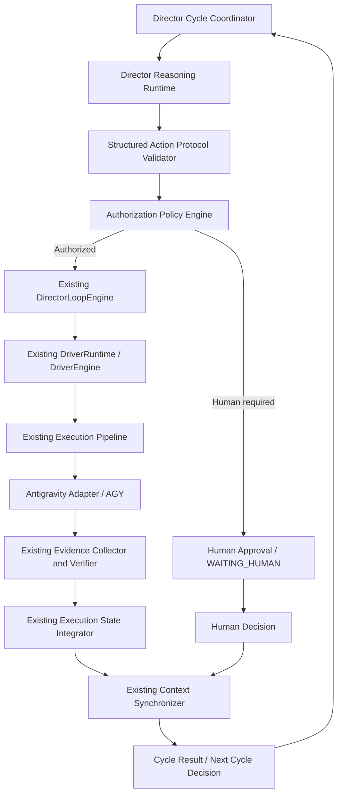

# OtonomMCP --- Birlikte Geliştirme Ana Planı

**Belge türü:** Ana mimari ve uygulama yol haritası\
**Proje:** OtonomMCP\
**Depo:** https://github.com/naziffarm4/OtonomMCP\
**Çalışma modeli:** ChatGPT Director + AIDM Orchestrator + Antigravity
Executor\
**Belge durumu:** Güncel ana plan ve devam yol haritası — 2026-10-04
**Güncelleme:** Mevcut P18/P19/P20/P21 ve TRUST-ROOT bulguları işlendi; Director-only kullanıcı etkileşimi ve doğru devam sırası eklendi.

------------------------------------------------------------------------

------------------------------------------------------------------------

# Güncel durum ve bağlayıcı devam sırası — 2026-10-04

Bu bölüm, belgenin önceki başlangıç planını mevcut proje durumuna göre günceller.
Çelişki halinde bu bölüm ve Ek D, eski başlangıç durumu/varsayımlarından önceliklidir.

## Mevcut durum özeti

| Alan | Son bilinen durum | Plan kararı |
|---|---|---|
| P18 Director Reasoning / bütçe | P18-01/02/03 implementasyon ve testleri raporlandı; gerçek provider çağrısı henüz kanıtlanmadı. P18-04 trusted auth bağlamı bekliyor. | P18-03'ü somut hata yoksa yeniden açma. Gerçek provider smoke testi ayrıca ve yalnızca açık maliyet onayıyla yapılır. |
| P19 Action Protocol | P19-01/02/03 tamamlandı olarak raporlandı; dispatcher, action validation ve idempotency hattı mevcut. | Tamamlandı kabulü korunur; regresyon hatası çıkarsa hedefli düzelt. |
| P21 Authorization Policy | Policy engine/mandate enforcement testleriyle kabul edildi olarak raporlandı. | Tamamlandı kabulü korunur; trusted human identity yerine geçmez. |
| P20 Execution Bridge | P20-01 ve güvenlik sertleştirmeleri mevcut; gerçek IDE/human trust root yokluğu nedeniyle Check 6 ve P20-01D engelli. | P20 tam kapalı çevrim olarak kabul edilmez. Güven kökü çözülmeden insan onayı kapısı gevşetilmez. |
| Trusted IDE / human approval | TRUST-ROOT-01/02/03 araştırma ve izole PoC raporları mevcut. TPM key işlemi gösterildi; CNG modalı işlem içeriğini göstermiyor. | Üretim entegrasyonu için NO-GO. TRUST-ROOT-04 sıradaki araştırma görevi. |
| Director kullanıcı kanalı | Ana planda ChatGPT Director tek kullanıcı arayüzü olarak tariflenmiş; Antigravity IDE sohbetinin Director'a güvenilir soru/yanıt/option callback kanalı olup olmadığı kanıtlanmamış. | Mimariyi değiştirmeden teknik fizibilite denetimi yapılacak. |

AGY raporlarındaki test/commit/push sonuçları, bu sohbet içinde bağımsız olarak depo üzerinde doğrulanmış sayılmaz; kanıt seviyesi raporlanmış sonuç olarak korunur. TRUST-ROOT-03'teki bazı görsel dosyalar AI mockup olarak üretildiği için gerçek Windows güvenlik penceresi ekran görüntüsü kanıtı sayılmaz. Testlerin gerçek stdout/JSON çıktısı ayrıca doğrulanmadan 12/12 sonucu bağımsız doğrulanmış kabul edilmez.

## Bağlayıcı mimari kararı: kullanıcı yalnızca Director ile konuşur

- Kullanıcının tek muhatabı **ChatGPT Director** olacaktır. Kullanıcı AIDM Orchestrator veya AGY ile doğrudan karar/izin/clarification alışverişi yapmayacaktır.
- Gereksinim belirsizliği, ek bilgi, seçenek, ürün kararı, insan onayı, ret, erteleme ve sonuç bildirimi Director tarafından kullanıcıya sunulur.
- AIDM ve AGY ihtiyaçlarını, hata ve önerilerini Director'a yapılandırılmış biçimde iletir. Kullanıcıya doğrudan soru sormaz ve kendisini karar sahibi olarak sunmaz.
- AIDM içindeki reasoning/provider runtime, aynı mantıksal Director'ın arka plandaki yürütme kabiliyeti olabilir; **ikinci/bağımsız bir Director veya rakip karar sahibi değildir**. Tek session, tek karar zinciri ve tek kullanıcıya dönük kimlik korunur.
- Director'ın Antigravity IDE sohbet penceresini kullanması hedeflenen UX seçeneğidir; ancak IDE'nin desteklenen API/extension/MCP yetenekleri kanıtlanmadan uygulanabilir olduğu varsayılmaz.
- IDE chat üzerinden gelen metin/choice cevabı tek başına güvenilir Product Owner kimliği veya güvenli insan onayı kanıtı değildir. İnsan onayı gerekiyorsa onaylanan işlem, proje/workspace/session/task/action, context fingerprint, nonce, mandate/policy revision ve expiry ile kriptografik olarak bağlanmalı; güven kökü ayrıca doğrulanmalıdır.
- IDE chat bunu desteklemiyorsa AIDM'ye ikinci bir sohbet arayüzü veya yeni bir ajan eklenmez. Director'ın tek muhatap olma ilkesi korunarak desteklenen alternatif kanal(lar) fizibilite raporunda seçenek olarak sunulur; kullanıcı kararı olmadan mimari değişmez.

## Güncel uygulama sırası

Aşağıdaki sıra mevcut durumdan devam etmek için bağlayıcıdır. Eski §6'daki faz sırası genel bağımlılık sırası olarak kalır; bu liste mevcut engeller ve tamamlanmış işler dikkate alınarak önceliklidir.

1. **TRUST-ROOT-04 — Secure Companion Trust Architecture & Threat Model (READ-ONLY).** Aynı Windows kullanıcısı altındaki kötü niyetli süreç, sahte Companion/UI, IPC taklidi, payload substitution, TOCTOU, UI automation/clickjacking, binary integrity, TPM imza çağrısı, nonce/replay, workspace/session ayrımı ve kullanıcı onayının gerçek anlamını tehdit modeliyle incele. Companion çözümünü peşinen seçme; en az üç mimari alternatifi karşılaştır. TRUST-ROOT-03 test kanıtlarının gerçekliğini de denetle. Kaynak kod/konfigürasyon/bağımlılık değişikliği yok.
2. **DIRECTOR-INTERACTION-01 — Director-Only IDE Chat Feasibility Audit (READ-ONLY).** Antigravity IDE'nin desteklenen chat/extension/API/MCP mekanizmalarıyla Director'ın kullanıcıya seçenekli soru/clarification/approval sunup yanıtı aynı session/action'a güvenli bağlayıp bağlayamayacağını kanıtla. Yalnızca resmi/desteklenen arayüzleri kullan; UI otomasyonu veya private API'yi güvenilir kabul etme. Tek muhatap Director kuralını ve yukarıdaki güvenlik gereksinimlerini koru. TRUST-ROOT-04 ile aynı anda araştırılabilir; ikisi de tamamlanmadan tasarım/uygulama kararı verme.
3. **TRUST-ROOT-05 — Human Approval Root-of-Trust Decision & Isolated Validation.** TRUST-ROOT-04 ve DIRECTOR-INTERACTION-01 raporlarına dayanarak hedef trust architecture'ı seçmek için karar kaydı hazırla. Seçilen yol Companion gerektiriyorsa yalnızca izole PoC planı/deneyi yap; üretim entegrasyonu, paket veya runtime değişikliği için ayrı açık karar ve kabul kapısı gerekir. WYSIWYS (kullanıcının gördüğü işlem ile imzalanan/çalıştırılan işlemin birebir aynı olması), signed IPC, binary integrity, OS identity, same-user threat, anti-replay ve fail-closed kanıtları zorunludur.
4. **P18-04 / P20 Trusted Human Authentication Gate.** Güven kökü çözümü onaylandıktan sonra gerçek Product Owner proof, key custody, consent payload, nonce/expiry/revocation ve güvenli IPC doğrulamasını mevcut IdentityManager/AuthContextValidator/NonceStore/ProjectMandateStore/ExecutionBridge/AuthorizationPolicyEngine içine entegre et. Yeni EventStore/DAG/Driver oluşturma. P20 Check 6, yalnızca gerçek trust proof doğrulandığında geçsin; `verified:true` gibi istemci beyanları kabul edilmesin.
5. **P20-02 — Closed-loop Coordinator Completion.** P19 action sözleşmesi ve P21 policy zaten kabul edilmiş olduğundan mevcut Execution Bridge/DirectorLoopEngine/DriverRuntime/EvidenceCollector/State Integrator zincirini tamamla. Tek bounded cycle, aynı Director session, stale context/idempotency, AGY timeout/UNKNOWN, bağımsız evidence ve corrective task lineage doğrulansın. P20-01'i yeniden yazma; eksik kalan entegrasyonu tamamla.
6. **P22 — Director MCP Control Plane (resmî roadmap numarası).** Altı temel MCP tool ve gerçek stdio initialize/list/call, schema, transport auth, session/project isolation ve Director bağlantısını tamamla. TRUST-ROOT iş paketi P22 değildir; bu numara MCP Control Plane için ayrılmıştır.
7. **P23 — Durable Session & Recovery.** Var olan HistoryManager/DurableStateManager/event altyapısını kullan; aynı Director session/task lineage ile recovery, process ownership, partial output reconciliation ve dirty workspace korumasını tamamla.
8. **P24 — Real E2E Validation.** Gerçek provider + gerçek AGY + gerçek workspace/Git/test/build/evidence + MCP + Director-only human interaction akışını ayrı test katmanlarıyla doğrula. Gerçek provider çağrısı ücretlidir; kullanıcı açıkça onaylamadan çağrı yapma. Gerçek ChatGPT/IDE client testi yapılamazsa NOT RUN olarak raporla; mock testi yerine sayma.
9. **P25 — Production Hardening.** Güvenlik, secret storage/rotation, platform process lifecycle, concurrency, observability, backup/migration, Windows dağıtımı, limitler ve operasyonel izleme.

### Bu sırada kesinlikle yapılmayacaklar

- TRUST-ROOT-04 tamamlanmadan Companion Worker veya üretim trust entegrasyonu yazılmayacak.
- Director-only UX denetlenmeden AIDM/AGY için ayrı kullanıcı sohbeti, ikinci Director veya ikinci approval UI oluşturulmayacak.
- Güvenli onay kanıtı bulunmadan P20 Check 6 gevşetilmeyecek; `P20 BLOCKED_ON_AUTH_CONTEXT` durumu sahte biçimde kaldırılmayacak.
- Kullanıcının açık onayı olmadan ücretli provider çağrısı, API harcaması, commit veya push yapılmayacak.
- Otomatik zombie takeover, Force Unlock, ikinci IDE instance veya CLI tabanlı ayrı AIDM çalışma modu eklenmeyecek.
- Mevcut dirty/untracked Git çalışması silinmeyecek, resetlenmeyecek, clean/stash yapılmayacak.

---

## 1. Amaç ve hedef mimari

OtonomMCP'nin hedefi, bir yazılım projesini yalnızca komut çalıştıran
bir ajanla değil; proje durumunu bilen, iş planlayan, uygulamayı
yöneten, sonuçları bağımsız kanıtlarla doğrulayan ve gerektiğinde aynı
bağlamdan devam edebilen kontrollü bir geliştirme sistemiyle
ilerletmektir.

Hedef kapalı çevrim:

1.  Kullanıcı hedefi veya değişikliği tanımlar.
2.  ChatGPT, Director rolünde mevcut proje bağlamını inceler ve
    yapılandırılmış bir sonraki eylem önerir.
3.  AIDM, eylemi şema, proje/session/task bağlamı, yetki ve politika
    açısından doğrular.
4.  Mevcut Task DAG ve Driver altyapısı işi yürütür.
5.  Antigravity CLI (`agy`) kodlama, test ve build işlemlerini yapar.
6.  AIDM bağımsız kanıt toplar ve doğrular.
7.  Doğrulanmış sonuç proje durumuna entegre edilir.
8.  Aynı Director oturumu güncel bağlamla yeniden çalışır.
9.  Sistem tamamlanma, insan kararı, bekleme veya durdurma koşuluna
    ulaşana kadar kontrollü biçimde devam eder.

**Temel ilke:** LLM öneri üretir; AIDM doğrular ve yetkilendirir; AGY
uygular; kanıt sistemi sonucu doğrular. Hiçbir bileşen kendi iddiasını
tek başına başarı kanıtı sayamaz.

## 2. Roller ve sorumluluk sınırları

  -----------------------------------------------------------------------
  Bileşen                 Sorumluluk              Yapmaması gereken
  ----------------------- ----------------------- -----------------------
  Kullanıcı / Product     Ürün hedefi, kapsam,    Her rutin kod
  Owner                   kritik kararlar,        değişikliğini tek tek
                          başlangıç yetkisi       onaylamak zorunda
                                                  kalmamalı

  ChatGPT Director        Bağlamı yorumlamak,     Kendi kendine yetki
                          planlamak, eylem        vermek veya doğrudan
                          önermek, sonuçları      sınırsız komut
                          değerlendirmek          çalıştırmak

  MCP Control Plane       Director ile AIDM       İş mantığının veya
                          arasında standart,      kalıcı durumun tek
                          doğrulanabilir protokol kaynağı olmak
                          sağlamak                

  AIDM Orchestrator       Yetki, politika, görev  İkinci bir
                          DAG'ı, lifecycle,       DAG/FSM/driver
                          koordinasyon ve kalıcı  oluşturmak
                          durum                   

  Driver / Execution      Mevcut yürütme yaşam    Director kararlarını
                          döngüsünü yönetmek      veya yetkilendirmeyi
                                                  taklit etmek

  Antigravity (`agy`)     Yetkilendirilmiş        Kendi başarısını
                          görevleri kodda         bağımsız kanıt olarak
                          uygulamak               ilan etmek

  Evidence Collector /    Test, build, git ve     AGY'nin serbest metin
  Verifier                diğer doğrulama         beyanını kanıt saymak
                          kanıtlarını toplamak    
  -----------------------------------------------------------------------

## 3. Mimari kurallar ve değişmezler

Aşağıdaki kurallar tüm fazlarda geçerlidir:

1.  **Tek proje gerçeği:** AIDM'nin kalıcı proje durumu authoritative
    source of truth olarak kalır.
2.  **Tek görev grafiği:** İkinci bir Task DAG motoru oluşturulmaz.
3.  **Tek execution loop:** `DirectorLoopEngine`, `DriverEngine` ve
    `DriverRuntime` incelenmeden bunların yerine yeni bir döngü
    yazılmaz.
4.  **Tek kanıt hattı:** Mevcut Evidence Collector/Verifier yeniden
    kullanılmalıdır.
5.  **Tek kalıcı durum mimarisi:** İkinci bir `DurableStateManager` veya
    çakışan event/history kaynağı oluşturulmaz.
6.  **Oturum sürekliliği:** Her iterasyonda yeni Director session
    açılmaz. Aynı session ve task lineage korunur.
7.  **Yetki ayrılığı:** ChatGPT eylem önerir; AIDM policy ve
    authorization katmanı yetki verir.
8.  **Kanıta dayalı tamamlanma:** AGY'nin "bitti" demesi tamamlanma
    değildir. Kabul kriterleri ve bağımsız kanıtlar gerekir.
9.  **İdempotency:** Tekrarlanan mesaj, action veya recovery aynı işi
    kontrolsüz biçimde ikinci kez başlatmamalıdır.
10. **Stale context koruması:** Eski context fingerprint veya task
    revision ile gelen action reddedilmeli ya da güvenli biçimde yeniden
    değerlendirilmelidir.
11. **İnsan kararı korunur:** Ürün kapsamı, geri dönüşsüz mimari
    değişiklik, güvenlik politikası ve harici maliyet gibi kararlar
    insana aittir.
12. **Sınırlı özerklik:** Yetki proje, dosya yolları, komutlar, süre,
    maliyet ve risk bakımından sınırlandırılır.
13. **Güvenli durdurma:** Pause, resume, stop ve crash recovery
    işlemleri kalıcı ve denetlenebilir olmalıdır.
14. **Gözlemlenebilirlik:** Her cycle, action, execution, evidence ve
    karar ilişkilendirilebilir ID'lerle izlenebilmelidir.

## 4. Mevcut altyapıdan hareket noktası

Önceki depo incelemesinde aşağıdaki alanların mevcut olduğu görülmüştü.
Bu liste güncel commit üzerinde yeniden doğrulanmalıdır; dosya veya
sınıf isimleri değişmiş olabilir.

-   MCP JSON-RPC server, tool registry, `tools/list`, `tools/call`, hata
    normalizasyonu ve secret sanitization.
-   MCP stdio transport ve CLI giriş noktaları.
-   Director session, context snapshot, decision engine, authorization
    ve human approval altyapısı.
-   `DirectorContextSynchronizer` ve fingerprint/revision temelli
    context senkronizasyonu.
-   Execution request builder, executor port, Antigravity
    adapter/process runner.
-   System evidence collector ve execution evidence modelleri.
-   Execution state integration.
-   Driver engine/runtime ve lifecycle işlemleri.
-   Task DAG, corrective task lineage, recovery/retry ve durable state
    altyapısı.
-   LLM bridge ve provider abstraction.
-   Director loop ve `phase11` MANUAL continuation mekanizması.

Bu varlıkların bulunması tek başına gerçek entegrasyonun çalıştığını
kanıtlamaz. Özellikle gerçek ChatGPT provider bağlantısı, gerçek `agy`
süreci, MCP stdio başlatma, approval policy ve crash recovery uçtan uca
test edilmelidir.

## 5. Fazlar ve teslimatlar

### Faz 0 --- Mimari ve entegrasyon denetimi (P18-00)

**Amaç:** Kod değiştirmeden gerçek mevcut durumu tespit etmek ve sonraki
geliştirme kararlarını kanıtla temellendirmek.

İncelenecek konular:

-   Gerçek LLM provider/adapter zinciri ve kimlik doğrulama
    yapılandırması.
-   ChatGPT yanıtının Director kararına dönüştüğü gerçek sınıf ve çağrı
    yolu.
-   MCP stdio server'ın CLI üzerinden gerçek başlatma yolu.
-   MCP tool → delegate/facade → Driver → Executor → AGY zinciri.
-   `DirectorLoopEngine`, `DriverEngine`, `DriverRuntime` sorumluluk
    sınırları.
-   `phase11` MANUAL continuation akışı.
-   Approval Package gerektiren işlemler ve rutin işlerdeki gereksiz
    onay engelleri.
-   `DirectorContextSnapshot` kapsamı ve eksik authoritative veriler.
-   Mock testler ile gerçek provider/AGY E2E testlerinin ayrımı.
-   Persistence, idempotency, recovery ve evidence kaynakları.
-   Güvenlik sınırları ve mevcut açıklar.

**Teslimatlar:**

-   Mevcut akışın dosya/sınıf/metot referanslı mimari haritası.
-   Çalışan, kısmen çalışan, mock, eksik ve doğrulanmamış parçaların
    sınıflandırması.
-   Çakışan sorumluluklar ve yeniden kullanım önerileri.
-   P18--P25 planında gerekli değişiklikler.
-   Risk listesi ve bağımlılıklar.
-   Önerilen ilk küçük uygulama görevi.

**Kısıt:** Bu fazda kaynak kod, konfigürasyon, lockfile, veritabanı veya
proje durumu değiştirilmez.

### Faz 1 --- Director Reasoning Runtime (P18)

**Amaç:** Gerçek ChatGPT/uyumlu LLM provider'ını mevcut Director
bağlamına bağlamak.

Muhtemel yeni alan (denetim sonucu doğrulanacak):

`packages/core/src/director-runtime/`

Olası modüller:

-   `director-ai-runtime.ts`
-   `director-reasoning-engine.ts`
-   `director-prompt-builder.ts`
-   `director-response-parser.ts`
-   `director-context-loader.ts`
-   `director-reasoning-types.ts`
-   `director-reasoning-errors.ts`

Kurallar:

-   Mevcut `llm-bridge/`, provider registry, token budget ve Director
    altyapısı yeniden kullanılmalı.
-   Yeni provider abstraction ancak mevcut soyutlama yetersizliği
    kanıtlanırsa eklenmeli.
-   Prompt yalnızca güncel, authoritative context snapshot üzerinden
    kurulmalı.
-   Model çıktısı yapılandırılmış ve şema doğrulamalı olmalı.
-   Timeout, rate limit, malformed output, provider error ve token
    bütçesi ele alınmalı.
-   LLM çıktısı hiçbir koşulda doğrudan execution authorization
    sayılmamalı.

**Kabul ölçütleri:**

-   Gerçek provider yapılandırması güvenli şekilde yükleniyor.
-   Gerçek istek/yanıt akışı test ediliyor.
-   Mock testler gerçek entegrasyon testlerinden ayrılmış.
-   Çıktı parse ve schema validation'dan geçiyor.
-   Context fingerprint ve session/project binding korunuyor.
-   Secret değerler log/prompt çıktısına sızmıyor.
-   Hata durumları kontrollü ve tekrar denenebilir biçimde raporlanıyor.

### Faz 2 --- Structured Director Action Protocol (P19)

**Amaç:** Director'ın serbest metin yerine doğrulanabilir eylem
sözleşmesi üretmesi.

Olası eylemler:

-   `IMPLEMENT_TASK`
-   `CREATE_TASK`
-   `CREATE_CORRECTIVE_TASK`
-   `REPLAN`
-   `REVIEW_EVIDENCE`
-   `REQUEST_HUMAN_DECISION`
-   `PROJECT_COMPLETE`
-   `PAUSE`
-   `STOP`

Her action en azından protokol sürümü, action ID, project ID, Director
session ID, context fingerprint, action türü ve ilgili task/revision
bilgilerini taşımalıdır.

**Kabul ölçütleri:**

-   Şema ve anlamsal doğrulama.
-   Proje/session/task bağlamı doğrulaması.
-   Stale fingerprint/revision reddi.
-   Idempotency ve duplicate action kontrolü.
-   Director'ın Product Owner kimliğine bürünmesinin engellenmesi.
-   Corrective task parent/lineage ilişkisinin korunması.

### Faz 3 --- Otonom yetkilendirme politikası (P21)

**Amaç:** Rutin teknik işler için her seferinde insan onayı
gerektirmeyen, ancak sınırları net bir yetki modeli oluşturmak.

İncelenecek mevcut alanlar:

-   `approval/approval-package-engine.ts`
-   `approval/approval-store.ts`
-   `director/human-approval-engine.ts`
-   `director/director-decision-engine.ts`
-   `director-loop/director-loop-engine.ts`
-   `driver/driver-engine.ts`
-   `recovery/retry-authorization-service.ts`
-   `recovery/corrective-task-service.ts`

Önerilen model:

-   Kullanıcı proje için bir kez sınırlandırılmış mandate tanımlar.
-   İzin verilen dizinler, işlemler, komutlar ve otomatik görev türleri
    açıkça belirlenir.
-   Rutin read/write/test/build/refactor işlemleri mandate içinde
    otomatik yürüyebilir.
-   Ürün gereksinimi değiştirme, dış satın alma, geri
    dönüşsüz/destructive işlem, güvenlik politikası değişikliği ve
    kritik mimari kararlar insan kapısına gider.
-   Yetki süresi, maliyet ve kaynak sınırları uygulanır.

**Kabul ölçütleri:**

-   Her eylem policy tarafından sınıflandırılır.
-   Yetki kapsamı dışındaki işlem engellenir.
-   Rutin ve düşük riskli işler için gereksiz onay döngüsü oluşmaz.
-   İnsan onayı gereken işlemler bekleme durumuna geçer.
-   Yetki ve karar kayıtları audit edilebilir.

### Faz 4 --- Closed-loop Coordinator (P20)

**Amaç:** Reasoning, action validation, authorization, mevcut Driver
yürütmesi, evidence ve context refresh adımlarını aynı kontrollü
çevrimde birleştirmek.

Akış:

`Context → Reasoning → Action Validation → Authorization → Existing Driver → AGY → Evidence → Verification → State Integration → Context Refresh`

Yeni Coordinator mevcut `DirectorLoopEngine` ve `DriverRuntime` yerine
geçmemelidir. Sorumlulukları yalnızca bu bileşenler arasında
koordinasyon olmalıdır.

**Kabul ölçütleri:**

-   Bounded cycle/iteration limiti.
-   Aynı task/action'ın tekrar tekrar üretilmesine karşı koruma.
-   Stale context ve idempotency kontrolü.
-   Timeout, test failure, infrastructure failure ve human-wait
    durumları.
-   Tamamlanma için doğrulanabilir kabul kriterleri.
-   Sınırsız `while(true)` veya kontrolsüz recursive çağrı bulunmaması.

### Faz 5 --- Director MCP Control Plane (P22)

**Amaç:** ChatGPT Director'ın kullanacağı küçük ve kararlı bir yüksek
seviye MCP arayüzü oluşturmak.

Aday araçlar:

-   `aidm.director.open`
-   `aidm.director.context`
-   `aidm.director.act`
-   `aidm.director.cycle`
-   `aidm.director.result`
-   `aidm.director.status`
-   `aidm.director.decisions`
-   `aidm.director.resolve`
-   `aidm.director.pause`
-   `aidm.director.resume`
-   `aidm.director.stop`

Mevcut MCP server, delegate, CLI ve düşük seviye tool'lar yeniden
kullanılmalı. ChatGPT'ye gereksiz iç uygulama ayrıntısı açılmamalı.
Sınırsız shell çalıştıran bir MCP aracı eklenmemeli.

**Kabul ölçütleri:**

-   MCP initialize/list/call gerçek stdio üzerinden doğrulanır.
-   Input/output schema ve hata sözleşmeleri kararlıdır.
-   Session ve project isolation test edilir.
-   Yetkisiz tool çağrıları reddedilir.
-   Tool sonuçları ilgili cycle/action/evidence kimliklerini taşır.

### Faz 6 --- Durable Session ve Recovery (P23)

**Amaç:** Süreç veya makine kesintisinden sonra aynı Director session ve
task lineage ile güvenli devam etmek.

Önce mevcut HistoryManager, DurableStateManager, event ve audit
altyapısı haritalanmalı. Yeni EventStore ancak mevcut yapının
yetersizliği kanıtlanırsa eklenmeli.

Recovery davranışı:

-   Kalıcı session/cycle durumunu yükle.
-   In-flight execution durumunu tespit et.
-   Git/workspace ve evidence durumunu incele.
-   Kesintiye uğrayan görevi körlemesine tekrar başlatma.
-   Gerekirse önceki execution sonucunu reconcile et.
-   Context snapshot'ı yenile.
-   Güvenli noktadan aynı session ile devam et.

İnsan müdahalesi akışı:

`RUNNING → WAITING_HUMAN → HUMAN_DECISION_RESOLVED → CONTEXT_REFRESHED → RUNNING`

**Kabul ölçütleri:**

-   Crash/restart senaryoları test edilir.
-   Duplicate execution oluşmaz.
-   Yarım kalmış AGY süreci güvenli biçimde ele alınır.
-   Session, task lineage ve audit zinciri korunur.

### Faz 7 --- Gerçek uçtan uca doğrulama (P24)

**Amaç:** Mock'ların ötesinde gerçek provider, MCP, AGY, workspace, Git,
test/build ve evidence hattını doğrulamak.

Önerilen test alanları:

-   Gerçek reasoning provider bağlantısı.
-   MCP stdio başlatma ve tool çağrıları.
-   AGY process başlatma ve tamamlanma.
-   Stale fingerprint.
-   Duplicate action/idempotency.
-   AGY başarılı dediği halde testin başarısız olması.
-   Yanlış dosyalara değişiklik yapılması.
-   Corrective task lineage.
-   İnsan müdahalesinden aynı session ile devam.
-   Crash recovery.
-   Proje tamamlanma kontrolü.

Mock, contract, integration ve gerçek E2E testleri ayrı etiketlenmeli.
Gerçek E2E testleri maliyetli veya dış servis bağımlıysa opt-in
çalıştırılmalı; CI'da yanlışlıkla ücretli çağrı yapılmamalı.

### Faz 8 --- Üretim sertleştirmesi (P25)

**Amaç:** Sistemi güvenli, izlenebilir, yönetilebilir ve uzun süre
çalışabilir hale getirmek.

Alanlar:

-   Process isolation ve kaynak limitleri.
-   Dosya yolu/symlink/path traversal koruması.
-   Komut allowlist ve güvenli çalışma dizini.
-   Secret management ve log redaction.
-   Eşzamanlılık ve lock yönetimi.
-   Rate limit, timeout, retry ve circuit breaker.
-   LLM token/maliyet bütçesi.
-   AGY çalışma süresi ve kaynak tüketimi.
-   Structured logging, tracing ve audit.
-   Yedekleme ve geri yükleme.
-   Windows/Linux dağıtım ve kurulum.
-   Sürümleme ve migration.
-   Operasyonel sağlık kontrolleri.

İzlenecek metrikler:

-   LLM maliyeti ve token kullanımı / task.
-   AGY çalışma süresi.
-   Execution pass/fail oranı.
-   Corrective task sayısı.
-   Tekrarlayan hata sayısı.
-   Ortalama context boyutu.
-   Recovery sayısı ve sonucu.
-   İnsan müdahalesi sayısı.
-   Task ve proje tamamlanma süresi.

## 6. Bağımlılık ve uygulama sırası

Önerilen sıra:

1.  P18-00 --- Read-only mimari/entegrasyon denetimi.
2.  P18 --- Director Reasoning Runtime.
3.  P19 --- Structured Action Protocol.
4.  P21 --- Autonomous Authorization Policy.
5.  P20 --- Closed-loop Coordinator.
6.  P22 --- Director MCP Control Plane.
7.  P23 --- Durable Session & Recovery.
8.  P24 --- Real E2E Validation.
9.  P25 --- Production Hardening.

P19 ve P21 kısmen paralel analiz edilebilir; fakat P20 başlamadan action
sözleşmesi ve yetki politikası kararlı hale gelmelidir.

## 7. Her görev için zorunlu çalışma protokolü

Antigravity'ye verilecek her uygulama görevi aşağıdaki sırayı
izlemelidir:

1.  İlgili dosyaları ve çağrı zincirini incele.
2.  Görev kapsamını ve mevcut mimariye etkisini açıkla.
3.  Değişiklik planını çıkar.
4.  Mevcut davranış ve testleri koru.
5.  Yalnızca görev kapsamındaki dosyaları değiştir.
6.  İlgili testleri çalıştır.
7.  Gerekliyse typecheck, lint, build ve daha geniş testleri çalıştır.
8.  Git diff ve status incele.
9.  Her kabul kriterini kanıtla eşleştir.
10. Değişiklikleri, test sonuçlarını, başarısız testleri ve riskleri
    raporla.

**Kanıt standardı:**

-   "Testler geçti" ifadesi komut ve gerçek özet çıktısıyla
    desteklenmelidir.
-   Çalıştırılmayan test "geçti" diye raporlanamaz.
-   Mock test sonucu gerçek servis entegrasyonu olarak sunulamaz.
-   Dosya değişikliği, diff veya commit referansıyla gösterilmelidir.
-   Bilinmeyen veya doğrulanmamış noktalar açıkça işaretlenmelidir.

## 8. ChatGPT ile çalışma protokolü

Her fazda kullanıcı Antigravity çıktısını bu sohbete aktarır. Ben:

-   Raporu görev kapsamı ve kabul kriterleriyle karşılaştırırım.
-   Eksik kanıtları belirlerim.
-   Mimari sapmaları ve gereksiz yeni altyapıları tespit ederim.
-   Gerekirse düzeltme promptu hazırlarım.
-   Fazın tamamlanıp tamamlanmadığına karar vermek için kanıtları
    değerlendiririm.
-   Sonraki fazın promptunu ancak önceki faz kabul edildiğinde veririm.

Bir fazın tamamlanması yalnızca Antigravity'nin "completed" demesine
bağlı değildir. Kabul kriterleri ve kanıtlar karşılanmalıdır.

### Kullanıcının Antigravity'den geri getireceği bilgiler

-   Tam rapor.
-   Değişen dosyalar (read-only fazlarda değişiklik olmamalı).
-   Çalıştırılan komutlar.
-   Test/build/typecheck sonuçları.
-   Git status ve varsa commit hash.
-   Çözülemeyen sorunlar ve belirsizlikler.

## 9. İlk görev --- P18-00

İlk görev uygulama değil, denetimdir. Bu aşamada kod yazılmayacak ve
dosya değiştirilmeyecektir.

Antigravity'ye verilecek prompt bu belgenin yanında ayrı olarak
hazırlanmıştır. Denetim tamamlanınca rapor ChatGPT'ye aktarılacak;
P18'in gerçek kapsamı denetim bulgularına göre kesinleştirilecektir.

## 10. Proje başarı tanımı

Sistem ancak aşağıdaki koşullar birlikte sağlandığında hedefe ulaşmış
sayılır:

-   Kullanıcı hedefi Director tarafından doğru bağlama oturtulur.
-   Director aynı proje/session bağlamında yapılandırılmış action
    üretir.
-   AIDM action'ı doğrular ve sınırlandırılmış yetkiyle yürütmeye alır.
-   Mevcut Driver ve AGY işi yürütür.
-   Sonuç bağımsız kanıtlarla doğrulanır.
-   Doğrulanmış sonuç authoritative proje durumuna entegre edilir.
-   Director güncel context ile devam eder.
-   İnsan kararı gereken noktada sistem güvenli biçimde bekler.
-   Pause/resume/stop ve crash recovery güvenilir çalışır.
-   Duplicate task, duplicate execution, context drift ve sahte
    completion engellenir.
-   Gerçek E2E testleri sistemin bu davranışını gösterir.

**Önemli:** Bu belge hedef mimari ve çalışma planıdır; depodaki mevcut
durumun tamamlandığını iddia etmez. P18-00 bulguları doğrultusunda
güncellenmelidir.

---

# Ek A — P18-00 için zorunlu netleştirmeler

Bu ek, ana plandaki faz tanımlarını tamamlar ve P18-00 denetiminde zorunlu olarak ele alınmalıdır.

## A.1 ChatGPT bağlantı modeli: üç seçeneği birbirinden ayır

Denetim raporu aşağıdaki modelleri ayrı ayrı incelemelidir:

### Model A — ChatGPT istemcisi MCP üzerinden AIDM'yi kullanır

- ChatGPT, AIDM MCP sunucusuna MCP client olarak bağlanır.
- ChatGPT konuşması içinden AIDM araçları çağrılır.
- Director reasoning işlemini ChatGPT istemcisi gerçekleştirir.
- AIDM, kendiliğinden yeni ChatGPT yanıtı ürettiğini varsayamaz.
- Bağlantı biçimi (stdio, Streamable HTTP, HTTPS endpoint veya güvenli tunnel) kullanılan ChatGPT istemcisinin güncel desteklediği yöntemle doğrulanmalıdır.
- ChatGPT istemcisinin oturumu kapandığında veya yeni bir kullanıcı mesajı gelmediğinde AIDM'nin reasoning döngüsünün devam edip edemeyeceği açıkça test/analiz edilmelidir.

### Model B — AIDM kendi içinden LLM API çağrısı yapar

- AIDM, mevcut `llm-bridge` ve provider abstraction üzerinden OpenAI API veya seçilmiş başka bir provider'a istek gönderir.
- Reasoning döngüsü AIDM tarafından başlatılabilir ve sürdürülebilir.
- API anahtarı, model seçimi, timeout, retry, rate limit, token ve maliyet kontrolü AIDM sorumluluğundadır.
- Bu model ChatGPT Desktop oturumuna bağlı değildir.
- ChatGPT aboneliği ile API kullanımı aynı faturalandırma/erişim mekanizması varsayılmamalıdır.

### Model C — Kontrollü hibrit

- ChatGPT istemcisi, kullanıcıyla etkileşim ve üst seviye yönetim için MCP üzerinden AIDM'ye bağlanır.
- AIDM, yalnızca açıkça tanımlanmış otonom continuation senaryolarında LLM API çağrısı yapar.
- İki reasoning yolunun görevleri, session bağları, maliyetleri ve yetki sınırları tanımlanır.
- Aynı cycle için iki bağımsız Director'ın çelişkili action üretmesi engellenir.
- AIDM'nin authoritative state ve authorization sorumluluğu değişmez.

### P18-00 raporunda zorunlu karar matrisi

| Kriter | Model A | Model B | Model C |
|---|---|---|---|
| Kullanıcı ChatGPT konuşmasından yönetebilir | Doğrulanacak | Ek MCP/arayüz gerekir | Doğrulanacak |
| Kullanıcı oturumu olmadan reasoning | Varsayılan olarak garanti değil | Evet, servis tasarımına bağlı | API yolu üzerinden |
| API credential ihtiyacı | ChatGPT istemci bağlantısına göre | Evet | API yolu için evet |
| Token/maliyet kontrolü | İstemci tarafı kullanım sınırları | AIDM içinde | Her iki kanal için ayrı |
| Otonom devam | İstemci etkileşimine bağlı | AIDM kontrolünde | AIDM kontrolünde |
| Operasyonel karmaşıklık | Daha düşük olabilir | Orta | Daha yüksek |

Denetçi her model için mevcut repo uyumluluğunu, eksik bileşenleri, güvenlik etkilerini, maliyet etkilerini ve gerçek test gereksinimlerini raporlamalıdır. Model seçimini varsayımla yapmamalıdır.

## A.2 Antigravity CLI gerçek sözleşmesinin doğrulanması

P18-00 sırasında kullanılan gerçek ortamda aşağıdaki bilgiler kaydedilmelidir:

- `agy` binary'nin tam yolu.
- Binary sürümü ve sürüm bilgisinin hangi komutla alındığı.
- `agy --help` tam çıktısı.
- İlgili alt komutların help çıktısı.
- Kullanılan çalışma ortamı ve işletim sistemi.
- Repo içindeki Antigravity adapter/process runner tarafından kullanılan gerçek flag'ler.
- Her flag'in kurulu binary tarafından kabul edilip edilmediği.
- Input protokolü ve encoding.
- Output protokolü ve encoding.
- JSON veya stream formatının gerçekten desteklenip desteklenmediği.
- stdout ve stderr ayrımı.
- Exit code davranışı.
- Timeout ve process termination davranışı.
- Prompt/response tamamlanma işaretleri.
- Süreç kesintisi ve kısmi çıktı davranışı.
- Interactive ve non-interactive çalışma farkları.
- Permission/sandbox davranışı.

### Güvenli doğrulama sırası

1. Binary yolunu bul ve sürümü tespit et.
2. `agy --help` çalıştır.
3. Yalnızca help dokümanında listelenen ilgili alt komutların help çıktısını incele.
4. Repo adapter'ındaki flag ve argümanları gerçek help çıktısıyla karşılaştır.
5. Eğer güvenli ve yan etkisiz bir non-interactive probe mümkünse, yalnızca geçici ve izole bir test dizininde çalıştır.
6. Probe için kullanılan prompt dosya değişikliği, shell komutu, dış ağ erişimi veya proje içi değişiklik istememelidir.
7. stdout, stderr, exit code, elapsed time ve timeout davranışını ayrı ayrı kaydet.
8. Desteklenmeyen flag veya formatları açıkça raporla.
9. `--dangerously-skip-permissions` gibi izinleri topluca devre dışı bırakan seçenekleri kullanma.
10. Gerçek AGY entegrasyonu çalıştırılmadıysa bunu açıkça “kod üzerinden incelendi, runtime doğrulaması yapılmadı” olarak belirt.

Önemli: Başka bir CLI sürümünün dokümanındaki flag'ler, kurulu binary'nin sözleşmesinin kanıtı değildir. Repo kodunda `stream-json` benzeri bir format kullanılması da CLI'nin bu formatı gerçekten desteklediğini tek başına kanıtlamaz.

## A.3 Token ve maliyet bütçesi P18'de başlamalı

Token/maliyet kontrolü P20'ye ertelenmemelidir. P18 Reasoning Runtime ilk gerçek provider çağrısını yaptığı anda bütçe kontrolü bulunmalıdır.

P18 kapsamındaki minimum kontroller:

- Provider/model bazında yapılandırılabilir model seçimi.
- İstek öncesi tahmini input token kontrolü.
- İstek başına maksimum input/output token sınırı.
- Reasoning çağrısı başına bütçe.
- Session başına bütçe.
- Proje veya çalışma dönemi başına bütçe.
- Maksimum reasoning çağrısı sayısı.
- Maksimum context boyutu.
- Bütçe dolduğunda güvenli durma veya insan kararı isteme.
- Provider usage verisi mevcutsa gerçek token tüketimini kaydetme.
- Usage verisi bulunmuyorsa tahmini tüketimi gerçek tüketim gibi göstermeme.
- Retry işlemlerinin bütçeyi tekrar tükettiğinin hesaba katılması.
- Maliyet hesaplamasında kullanılan model ve fiyatlandırma sürümünün kaydedilmesi.
- Secret ve hassas prompt verilerinin maliyet kayıtlarına sızmaması.

### P20 kapsamındaki genişletme

P20, P18'de oluşturulan bütçe mekanizmasını cycle düzeyinde uygular:

- Bir cycle içindeki toplam reasoning maliyeti.
- Bir task için toplam LLM maliyeti.
- Bir proje için toplam bütçe.
- Corrective task ve retry bütçeleri.
- AGY execution süresi ve diğer kaynak limitleriyle birlikte genel cycle budget.
- Bütçe aşıldığında yeni cycle başlatmama.
- Bütçe tüketiminin cycle/action/task kimlikleriyle ilişkilendirilmesi.

P18'de ikinci bir bütçe sistemi oluşturulmamalı; P20 aynı bütçe servisinin orchestration entegrasyonunu yapmalıdır.

## A.4 P18-00 kabul kriterlerine eklenecek maddeler

P18-00 tamamlanmış sayılmadan önce:

- [ ] ChatGPT istemcisi + MCP modeli gerçek bağlantı gereksinimleriyle açıklanmış olmalı.
- [ ] AIDM içinden LLM API çağrısı modeli gerçek repo call chain'iyle açıklanmış olmalı.
- [ ] Hibrit modelin çakışma ve session yönetimi değerlendirilmiş olmalı.
- [ ] Kullanıcının oturumu olmadan otonom devam gereksiniminin hangi modelle karşılanacağı açıklanmalı.
- [ ] Gerçek `agy` binary yolu ve sürümü kaydedilmeli (erişilemiyorsa neden erişilemediği belirtilmeli).
- [ ] Kurulu binary'nin help/flag sözleşmesi rapora eklenmeli.
- [ ] Adapter flag'leri ile gerçek CLI sözleşmesi karşılaştırılmalı.
- [ ] Input/output formatı ve stream protokolü doğrulanmalı veya doğrulanamadığı belirtilmeli.
- [ ] stdout, stderr, exit code, timeout ve termination davranışı incelenmeli.
- [ ] P18 için minimum token/maliyet bütçesi tasarımı ve mevcut altyapının yeniden kullanım planı verilmelidir.

---

# Ek B — P18 tasarım kapıları

P18 uygulaması başlamadan önce aşağıdaki tasarım kararları P18-00 kanıtlarıyla netleştirilmelidir:

1. Reasoning'in ana yürütme sahibi: ChatGPT istemcisi, AIDM API runtime veya kontrollü hibrit.
2. Kullanılacak gerçek provider ve model yapılandırma yöntemi.
3. Session ve context fingerprint'in LLM istek/yanıtlarına bağlanma yöntemi.
4. Token budget ve maliyet kayıtlarının mevcut token-budget altyapısıyla entegrasyonu.
5. Gerçek AGY CLI sözleşmesine uygun process adapter gereksinimleri.
6. Mock, contract, integration ve gerçek E2E test sınırları.

Bu kararlar verilmeden P18'de yeni runtime veya adapter kodu yazılmamalıdır.

---

# Ek C — Mimari kararların kesinleştirilmesi ve eksik operasyon kuralları

Bu ek, önceki bölümlerdeki belirsiz kalan kararları daraltır. Çelişki olması halinde bu ek ve P18-00 denetiminde alınacak kanıta dayalı kararlar esas alınır.

## C.1 Model seçimi için karar hiyerarşisi

### Birincil ürün gereksinimi

OtonomMCP'nin hedefi yalnızca ChatGPT açıkken MCP araçları çağırmak değildir. Kullanıcı ChatGPT konuşmasında aktif değilken de, önceden tanımlanmış yetki ve bütçe sınırları içinde AIDM'nin mevcut Director session'ını devam ettirebilmesi gerekir.

Bu gereksinim birincil ve zorunludur.

Buna göre:

- **Model A tek başına hedef mimariyi karşılamaz.** ChatGPT istemcisi MCP üzerinden AIDM'yi yönetmek için kullanılabilir; ancak ChatGPT istemcisinin kendi başına AIDM'nin kalıcı, kullanıcı oturumundan bağımsız reasoning runtime'ı olduğu varsayılamaz.
- **Model B teknik olarak sürekli reasoning ihtiyacını karşılayabilir.** AIDM kendi provider çağrılarını yapar. Ancak yalnızca Model B seçilirse ChatGPT istemcisinin MCP üzerinden interaktif yönetim rolü ayrıca tanımlanmalıdır.
- **Model C hedef mimari için tercih edilen başlangıç adayıdır.** AIDM'nin API tabanlı reasoning runtime'ı otonom devamın sahibi olur; ChatGPT istemcisi MCP üzerinden kullanıcı etkileşimi, gözlem, yönlendirme ve insan kararı kanalı olarak çalışır.

### Model C için kritik rol ayrımı

Model C, iki bağımsız Director'ın aynı session üzerinde eşzamanlı karar üretmesi anlamına gelmez.

Tek karar ve yürütme otoritesi bulunmalıdır:

- AIDM içindeki Director Runtime, otonom cycle'ın authoritative reasoning sahibidir.
- ChatGPT istemcisi MCP üzerinden AIDM'ye talimat, soru, karar veya müdahale iletir.
- ChatGPT istemcisi tarafından sunulan bir action da AIDM tarafından aynı action schema, context binding, authorization ve idempotency kontrollerinden geçirilir.
- Aynı session/cycle için iki reasoning sahibi eşzamanlı action üretemez.
- İnsan tarafından verilen kararlar Product Owner kararı olarak kaydedilir; model çıktısı insan kararı yerine geçemez.
- ChatGPT istemcisi kapansa da AIDM, yalnızca önceden yetkilendirilmiş görev ve bütçe sınırları içinde devam edebilir.

### P18-00 karar yöntemi

P18-00 üç modeli eşit seçenekler olarak bırakmamalıdır. Aşağıdaki karar sırası uygulanmalıdır:

1. Kullanıcı oturumu olmadan otonom devam zorunlu gereksinimidir.
2. Bu gereksinimi tek başına karşılamayan Model A, standalone target architecture olarak elenir.
3. Model B ve Model C, operasyonel gereksinimlere göre karşılaştırılır.
4. ChatGPT istemcisinden MCP ile interaktif yönetim de ürün gereksinimiyse Model C tercih edilir.
5. Model C'nin gerçek repo uyumluluğu, güvenlik, session ownership, token bütçesi ve test maliyeti kanıtlarla değerlendirilir.
6. Model C teknik veya operasyonel olarak uygulanamıyorsa Model B fallback hedef mimari olur; ChatGPT MCP arayüzü ayrı bir kullanıcı kontrol kanalı olarak tasarlanır.
7. Model A yalnızca interaktif/manuel kullanım modu olarak desteklenebilir; sürekli otonom çalışma modu olarak sunulamaz.

P18-00 raporu açıkça şu çıktıyı vermelidir:

- Seçilen hedef model.
- Neden diğer modellerin tek başına seçilmediği.
- Kullanıcı oturumu kapalıyken devamın teknik akışı.
- Director karar sahipliği ve session ownership kuralı.
- Model değiştirmenin mimari ve operasyonel maliyeti.
- Seçim için gereken açık Product Owner kararı varsa tam olarak ne olduğu.

## C.2 Model A seçilirse P18 kapsamını küçültme kuralı

Model A standalone olarak seçilirse AIDM içinde LLM API çağrısı yapan tam Director Reasoning Runtime geliştirilmemelidir. Bu durumda:

- P18, API tabanlı reasoning runtime geliştirmek yerine ChatGPT MCP etkileşimi için context packaging, action intake, validation ve session continuity gereksinimleriyle sınırlandırılır.
- Kullanıcı oturumu olmadan otonom devam gereksiniminin karşılanmadığı açıkça belirtilir.
- Sürekli otonom çalışma hedefi ertelenmiş sayılır; proje bu gereksinim karşılanmış gibi kabul edilemez.

Ancak bu proje için Model A tek başına hedef mimari olarak önerilmez; çünkü sürekli kapalı çevrim gereksinimini karşılamaz.

## C.3 P22 — Minimum MCP Control Plane

İlk sürümde 11 ayrı tool sunulmayacaktır. Başlangıç yüzeyi aşağıdaki altı tool ile sınırlandırılır:

| Tool | Amaç | Temel davranış |
|---|---|---|
| `aidm.director.open` | Proje/session açmak veya mevcut session'ı almak | Yeni session açmadan önce devam edilebilir session kontrolü |
| `aidm.director.context` | Güncel authoritative context'i almak | Snapshot, fingerprint, revision ve durum |
| `aidm.director.act` | Kullanıcı/Director action'ını göndermek | Şema, session, fingerprint, mandate ve authorization doğrulaması |
| `aidm.director.result` | Action/cycle sonucunu almak | Execution ve evidence referansları |
| `aidm.director.status` | Proje/session/cycle durumunu görmek | RUNNING, WAITING_HUMAN, PAUSED, FAILED, COMPLETED vb. |
| `aidm.director.control` | Pause, resume ve stop | Tek tool içinde enum kontrollü operasyon; her alt işlem ayrı authorization kontrolü |

`resolve`, ilk sürümde `act` üzerinden tiplenmiş human-decision action olarak ele alınabilir. `decisions` bilgisi context/status cevabında sunulabilir. Ayrı tool ancak kullanım kanıtı ve gerçek ihtiyaç oluşursa eklenir.

MCP tool sayısı tek başına başarı ölçütü değildir. Tool'lar dar, açık şemalı, idempotent ve yetki denetimli olmalıdır.

## C.4 P18 token bütçesi: mock doğrulaması ve gerçek maliyet ayrımı

P18'de bütçe kontrolü gerçek provider çağrısından önce uygulanmalıdır. Bütçe servisi provider adapter'dan bağımsız ve enjekte edilebilir olmalıdır.

### Test katmanları

**Unit tests — Mock provider**

- Sabit ve deterministik token usage değerleri kullanılır.
- Input/output limitleri, session/project budget, call count ve budget exhaustion test edilir.
- Retry'nin bütçeye etkisi test edilir.
- Provider çağrısı bütçe reddinden önce yapılmamalıdır.
- Mock testlerde gerçek maliyet oluşmaz.
- Mock usage değerleri gerçek provider ölçümü olarak raporlanmaz.

**Contract/integration tests — Gerçek provider olmadan**

- Request oluşturma, model/token limit parametreleri, usage parser ve hata eşlemesi contract test edilir.
- Sahte provider response fixture'ları kullanılır.
- Fiyatlandırma hesaplaması sabitlenmiş test fiyat tablosuyla doğrulanır.
- Bu testler API erişiminin veya gerçek maliyet doğruluğunun kanıtı değildir.

**Real provider smoke tests — Opt-in**

- Ayrı environment flag ile etkinleştirilir; varsayılan kapalıdır.
- Açıkça tanımlı düşük token limiti, tek çağrı limiti ve düşük harcama üst sınırı olmalıdır.
- Gerçek provider usage alanları kaydedilir.
- API çağrısı CI'da veya sıradan test komutunda otomatik tetiklenmez.
- API anahtarı loglanmaz.
- Gerçek maliyet yalnızca provider usage ve geçerli fiyatlandırma verisiyle hesaplanır; tahmin ayrı gösterilir.

Bütçe katmanı en az şu kavramları ayırmalıdır:

- `estimatedInputTokens`
- `actualInputTokens`
- `actualOutputTokens`
- `estimatedCost`
- `actualCost`
- `budgetLimit`
- `budgetRemaining`
- `usageSource` (mock, estimate, provider-reported)
- `pricingVersion`

## C.5 AGY bulunamazsa veya sürüm uyumsuzsa graceful degradation

AGY execution için mock fallback otomatik olarak kullanılmamalıdır. Mock executor yalnızca açık test/development konfigürasyonunda kullanılabilir.

### Runtime davranış matrisi

| Durum | Beklenen davranış |
|---|---|
| `agy` binary bulunamadı | Execution başlamaz; `EXECUTOR_UNAVAILABLE` / konfigürasyon hatası; task güvenli bekleme/blocked durumuna alınır |
| Sürüm tespit edilemiyor | Gerçek execution varsayılan olarak engellenir; sürüm belirsizliği raporlanır |
| Desteklenmeyen sürüm | `EXECUTOR_VERSION_UNSUPPORTED`; otomatik flag değiştirme veya sessiz fallback yapılmaz |
| CLI help/contract beklenen flag'i desteklemiyor | Adapter preflight başarısız olur; execution başlatılmaz |
| AGY process başlatılamadı | Process-start failure kaydedilir; task başarıya işaretlenmez |
| AGY timeout | Süreç güvenli şekilde sonlandırılmaya çalışılır; execution `INTERRUPTED`/`TIMED_OUT` olur; recovery incelemesi gerekir |
| AGY non-zero exit | Execution başarısız kabul edilir; evidence ve partial output korunur |
| AGY kısmi/bozuk output | Parse failure; raw output güvenli biçimde saklanır; başarı varsayılmaz |
| AGY geçici olarak kullanılamıyor | Otomatik retry yalnızca sınırlı retry policy ve mandate kapsamında |
| Test ortamında mock executor isteniyor | Açık `executorMode=mock` ve test ortamı şartı; production'da sessiz mock'a geçiş yasak |

Sistem hiçbir koşulda AGY bulunamadığı için gerçek işi mock executor ile yapılmış gibi göstermemelidir. Kullanıcıya blokaj nedeni, etkilenen task ve gereken düzeltme sunulmalıdır.

## C.6 P19 Action Protocol ile P21 Authorization bağı

P19 action schema, P21 yetki sınıflandırmasının gerektirdiği alanları taşımalıdır. Authorization P19 içinde uygulanmaz; P19 yalnızca doğrulanabilir talep sözleşmesini tanımlar. Yetki kararını P21 policy engine verir.

Action envelope için gerekli alanlar:

- `actionId`
- `projectId`
- `directorSessionId`
- `cycleId`
- `basedOnContextFingerprint`
- `understandingRevision`
- `type`
- `taskId` / `taskRevision` (ilgiliyse)
- `requestedOperation`
- `requestedResourceScope`
- `riskClass`
- `mandateId`
- `mandateRevision`
- `authorizationIntent`
- `idempotencyKey`

Kurallar:

1. `riskClass` model tarafından önerilebilir ancak authoritative risk sınıfı policy engine tarafından yeniden hesaplanır.
2. `requestedOperation` ve `requestedResourceScope` action'ın ne yapmak istediğini açıkça ifade eder.
3. `mandateId` ve `mandateRevision`, action'ın hangi proje yetkisine göre değerlendirileceğini belirtir.
4. Action içindeki mandate referansı kendi başına yetki vermez.
5. P21 mandate'in geçerli, süresi dolmamış, proje ile eşleşen ve istenen kaynak/işlemi kapsayan bir kayıt olduğunu doğrular.
6. Mandate kapsamı dışındaki eylemler reddedilir veya insan onayına yönlendirilir.
7. Product Owner yetkisi model çıktısıyla üretilemez veya genişletilemez.
8. Stale mandate revision ile gelen action yeniden değerlendirilmeden çalıştırılamaz.

P19 ve P21 geliştirmeleri bu ortak sözleşme üzerinden birlikte tasarlanmalıdır. P20, action schema ve authorization kararı kararlı hale gelmeden tamamlanmış sayılmaz.

## C.7 P20 Closed-loop Coordinator kesin sorumluluk sınırı

Coordinator yeni bir execution engine veya ikinci bir Director loop değildir. Sadece bir cycle'ın bileşenler arasında doğru sırada ilerlemesini sağlar.

### Hedef çağrı diyagramı

### Sorumluluklar

**Director Cycle Coordinator:**

- Cycle başlatma ve cycle state kaydı.
- Reasoning çağrısını tetikleme.
- Structured action doğrulamasını çağırma.
- Authorization sonucunu bekleme.
- Mevcut DirectorLoopEngine/Driver akışına uygun işi delege etme.
- Sonuç ve evidence tamamlanmasını bekleme.
- Context refresh sonrasında cycle sonucunu belirleme.
- Bounded iteration ve cycle-level budget guard uygulama.

**DirectorLoopEngine:**

- Mevcut Director loop/domain davranışını korur.
- Coordinator'ın yerine geçmez ve Coordinator tarafından kopyalanmaz.

**DriverRuntime / DriverEngine:**

- Mevcut execution lifecycle, task seçimi/delegasyonu, pause/resume/stop ve execution koordinasyonunu korur.
- LLM reasoning yapmaz.
- Yeni Coordinator'ın içine taşınmaz.

**Execution pipeline:**

- AGY process çalıştırma, process lifecycle ve evidence toplama işini korur.

Coordinator'ın doğrudan shell/AGY process başlatması veya task DAG'ı kendi içinde yönetmesi yasaktır.

## C.8 P23 crash recovery: AGY process, partial output ve dirty workspace

Recovery yalnızca kalıcı task state okumak değildir. In-flight process ve workspace değişiklikleri birlikte değerlendirilmelidir.

### Execution başlatmadan önce

- Execution ID, task ID, session ID, cycle ID ve çalışma dizini kaydedilir.
- Başlangıç Git HEAD ve başlangıç working-tree durumu kaydedilir.
- Process PID ve platforma uygun process identity bilgisi mümkün olduğunda kaydedilir.
- stdout/stderr çıktısının saklanacağı execution-scoped konum belirlenir.
- Execution timeout ve termination grace period kaydedilir.

### Crash sonrası recovery sırası

1. Kalıcı execution kaydını yükle.
2. Process'in hâlâ çalışıp çalışmadığını platforma uygun process identity ile doğrula; PID tek başına yeterli kabul edilmemelidir.
3. Process aynı execution'a ait ve hâlâ çalışıyorsa önce kontrollü graceful termination iste.
4. Grace period sonunda hâlâ çalışıyorsa yalnızca doğrulanmış process identity üzerinden zorla sonlandır.
5. Başka bir kullanıcı veya execution'a ait process'i sonlandırma.
6. stdout/stderr partial output dosyalarını oku; tamamlanmış output gibi işaretleme.
7. Exit code alınamadıysa bunu unknown/interrupted olarak kaydet; başarı varsayma.
8. Başlangıç ve mevcut Git/workspace durumunu karşılaştır.
9. Dirty workspace değişikliklerini silme, resetleme, checkout veya stash yapma.
10. Değişen dosyaları execution kapsamı, Git diff ve mümkün olan diğer kanıtlarla ilişkilendir.
11. Evidence verifier, task'ın kısmen uygulanıp uygulanmadığını değerlendirir.
12. Güvenli devam mümkün değilse `RECOVERY_REQUIRED` / `WAITING_HUMAN` durumuna geç.
13. Yeniden çalıştırma kararı verilmeden önce idempotency ve mevcut workspace değişiklikleri kontrol edilir.

### Temel kurallar

- Otomatik `git reset --hard`, `git clean`, checkout veya stash yasaktır.
- Partial output, başarılı execution kanıtı değildir.
- Bilinmeyen exit code başarılı kabul edilemez.
- Recovery aynı task'ı körlemesine yeniden başlatamaz.
- Process termination sonucu ve workspace reconciliation audit kaydına eklenmelidir.
- Platforma özgü process tree termination davranışı Windows ve Linux için ayrı doğrulanmalıdır.

## C.9 P24 E2E testlerine ChatGPT istemcisi + MCP senaryosu ekle

P24 test matrisi aşağıdaki ayrı senaryoları içermelidir:

1. **ChatGPT client → MCP server → AIDM:** ChatGPT istemcisinin gerçek MCP bağlantı yöntemiyle server'a bağlanması.
2. MCP initialize ve tool discovery.
3. `aidm.director.open` ile mevcut session'ı alma/devam ettirme.
4. `aidm.director.context` ile snapshot/fingerprint okuma.
5. `aidm.director.act` ile kullanıcı talimatı gönderme.
6. AIDM'nin action validation ve authorization uygulaması.
7. `aidm.director.status` ve `aidm.director.result` ile execution/evidence takibi.
8. ChatGPT istemci bağlantısı kapatıldığında AIDM'nin yetkilendirilmiş cycle'ı sürdürmesi (Model C/B için).
9. İstemci yeniden bağlandığında aynı session ve cycle durumunun görüntülenmesi.
10. İnsan kararı gerektiğinde istemci üzerinden kararın iletilmesi ve aynı session'dan devam.
11. ChatGPT istemcisinin gönderdiği stale veya duplicate action'ın reddedilmesi/idempotent ele alınması.

Gerçek ChatGPT client testinin yapılamadığı ortamlarda test `NOT RUN` olarak raporlanmalı; MCP unit/contract testleri bu senaryonun yerine geçmez.

Gerçek provider maliyet testi varsayılan olarak kapalı ve opt-in olmalıdır. Gerçek ChatGPT istemci/MCP bağlantı testi, API smoke testinden ayrı raporlanmalıdır.

## C.10 Production CLI giriş noktası ve servis yaşam döngüsü

P22/P25 teslimatları, kullanıcıya sunulacak kararlı CLI giriş noktasını tanımlamalıdır.

Önerilen komut ailesi (isimler mevcut CLI yapısı denetlendikten sonra kesinleştirilecek):

- `aidm mcp serve` — MCP stdio server.
- `aidm status` — proje/servis durumunu göster.
- `aidm director open` — proje Director session'ını aç veya devam ettir.
- `aidm director status` — Director session/cycle durumunu göster.
- `aidm director pause`
- `aidm director resume`
- `aidm director stop`

`aidm director serve` ancak ayrı, uzun yaşayan bir Director service gerçekten gerekiyorsa eklenmelidir. MCP stdio server ile Director background worker aynı process lifecycle'a zorla birleştirilmemelidir.

Teslimatlarda:

- Gerçek package binary/entry point.
- Komut help çıktıları.
- Windows ve Linux çalıştırma örnekleri.
- Exit code sözleşmesi.
- stdout/stderr sözleşmesi (özellikle MCP stdio'da stdout yalnızca protokol mesajları için).
- Config/env yükleme sırası.
- Signal handling ve graceful shutdown.
- Service/worker başlatma ve durdurma davranışı.
- Health/status komutları.

## C.11 Secret management ve credential injection

Secret yönetimi yalnızca log redaction değildir. Credential'ın nereden geldiği, nasıl process'e aktarıldığı ve nasıl korunduğu tanımlanmalıdır.

### Öncelik sırası

1. Desteklenen ortamlarda OS secret store / credential manager.
2. Servis çalıştırma ortamına güvenli şekilde inject edilen environment variable veya secret manager.
3. Gerekliyse kullanıcıya özel, erişim izinleri kısıtlanmış config/secret dosyası; dosya Git'e eklenmez ve şifreli/OS korumalı saklama değerlendirilir.

### Kurallar

- API key ve token'lar kaynak kodda, test fixture'larında veya repository config'inde tutulmaz.
- Secret değerleri CLI argümanlarına yazılmaz; process listelerinde görünebilir.
- Secret'lar log, error, prompt, MCP tool response, crash dump ve telemetry içeriğine sızmamalıdır.
- Child process'e yalnızca gerekli credential'lar allowlist üzerinden aktarılır.
- Environment variable kullanılıyorsa process environment erişim sınırları ve log sanitization değerlendirilir.
- MCP remote transport kullanılıyorsa TLS ve uygun authentication header/token doğrulaması gerekir.
- MCP stdio local transport için yerel process/user trust boundary açıkça belgelenmelidir.
- Credential rotation, revoke ve invalid credential davranışları tanımlanmalıdır.
- Secret bulunamadığında sistem güvenli biçimde fail-closed davranmalıdır.
- Mock/test credential'ları gerçek provider credential'larından ayrılmalıdır.

P18, LLM provider credential injection sözleşmesini tanımlamalıdır. P22, MCP transport authentication gereksinimlerini uygulamalıdır. P25, OS/service secret storage ve operasyonel rotation sertleştirmesini tamamlamalıdır.

## C.12 Güncellenmiş faz bağımlılıkları

| Faz | Yeni zorunlu bağımlılık / teslimat |
|---|---|
| P18-00 | Model seçimi karar hiyerarşisi, gerçek AGY sözleşmesi, token budget test stratejisi, credential mevcut durum denetimi |
| P18 | Gerçek provider üzerinden çalışan Director reasoning, credential injection, request/session/project token budget; mock/contract testlerine ek olarak zorunlu gerçek provider kanıtı |
| P19 | Action schema içinde requested operation/resource scope/risk/mandate reference ve revision |
| P21 | P19 action alanlarını authoritative policy ile değerlendiren mandate/authorization |
| P20 | Coordinator ↔ DirectorLoopEngine ↔ DriverRuntime kesin sınırı, cycle-level budget ve gerçek provider yanıtıyla doğrulanmış otonom cycle |
| P22 | Minimum altı MCP tool, production MCP CLI giriş noktası, transport auth |
| P23 | Process identity/termination, partial output reconciliation, dirty workspace preservation |
| P24 | Gerçek provider + gerçek AGY/workspace E2E zorunlu; gerçek ChatGPT client + MCP testi ayrı raporlanır |
| P25 | Secret storage/rotation, platform process hardening, production service lifecycle |

P20 için P19 action sözleşmesi ve P21 authorization sözleşmesi birlikte kararlı olmalıdır. P22, P20'nin koordinasyon sözleşmesi ve P19/P21 güvenlik sınırları netleşmeden tamamlanmış sayılmaz.

## C.13 Bağlayıcı karar — gerçek AI bağlantısı zorunludur

Bu bölüm, belgedeki mock/provider testleriyle ilgili daha önceki ifadelerle çelişki olması halinde önceliklidir. OtonomMCP'nin hedef çalışma mimarisi mock AI değil, gerçek bir LLM provider API'si üzerinden çalışan Director Reasoning Runtime'dır.

### Çalışma modu kuralları

- Normal çalışma ve production modunda gerçek provider bağlantısı zorunludur.
- AIDM'nin Director reasoning akışı, yapılandırılmış gerçek provider/model üzerinden gerçek API isteği göndermeli ve gerçek model yanıtını işlemelidir.
- Gerçek credential bulunamaz, geçersiz olur, provider'a erişilemez veya model kullanılamazsa sistem `fail-closed` davranmalıdır. AI kararı gerektiren işi mock yanıtla sürdürmek, boş/önbelleklenmiş yanıtı yeni model yanıtı gibi sunmak veya sessizce başka çalışma moduna geçmek yasaktır.
- Mock provider yalnızca açıkça seçilmiş test/development konfigürasyonunda kullanılabilir. Production/normal çalışma modunda `mock` seçimi başlatma doğrulamasında reddedilmelidir.
- Mock kullanımı her test ve log kaydında açıkça `mock` olarak etiketlenmelidir; mock çıktısı gerçek AI sonucu veya gerçek provider entegrasyon kanıtı olarak raporlanamaz.
- Provider adapter, model, API endpoint, timeout, retry, rate limit, token sınırları ve credential injection yapılandırılabilir olmalıdır. Gerçek provider seçimi ve kullanılan model çalışma kanıtında görünür olmalıdır.
- API credential'ı kaynak koda, repository config'ine, CLI argümanlarına veya loglara yazılmamalıdır. Credential yoksa sistem güvenli biçimde başlamayı reddetmeli veya AI gerektiren işlemi bloklamalıdır.

### Faz kabul kriterleri

**P18 — Director Reasoning Runtime** tamamlanmış sayılmadan önce:

- Gerçek provider'a yapılan başarılı bir API isteği ve gerçek model yanıtı, güvenli şekilde redakte edilmiş kanıtla gösterilmelidir.
- Gerçek provider/model kimliği, request/correlation ID, zaman, latency, token usage kaynağı ve varsa provider-reported usage kaydedilmelidir.
- Gerçek yanıt, Director'ın yapılandırılmış karar/action üretim zincirinden geçirilmelidir; yalnızca SDK çağrısı yapan bağımsız demo yeterli değildir.
- Gerçek credential eksikliği, authentication hatası, rate limit, timeout, provider outage ve malformed response senaryolarının güvenli davranışı test edilmelidir.
- P18'in otomatik testleri mock/fixture kullanabilir; ancak bunlar gerçek provider entegrasyon kanıtının yerine geçmez.

**P20 — Closed-loop Coordinator** tamamlanmış sayılmadan önce:

- Otonom cycle içinde en az bir karar gerçek provider yanıtıyla üretilmeli; action validation, authorization, execution ve bağımsız evidence hattından geçmelidir.
- Cycle devamı aynı authoritative session/context sahipliğiyle yürütülmelidir. ChatGPT istemcisinin bağlı olması her cycle için zorunlu olmamalıdır (Model B/C hedefinde).
- Provider hatasında kontrolsüz tekrar, sonsuz retry veya mock'a düşüş olmamalıdır.

**P24 — Real-world E2E Validation** tamamlanmış sayılmadan önce:

- Gerçek provider API + gerçek AGY + gerçek workspace/Git/test/build hattı ile uçtan uca senaryo çalıştırılmalıdır.
- ChatGPT client/MCP bağlantı testi ayrı bir senaryo olarak raporlanmalıdır; API smoke testi bunun yerine geçmez.
- Gerçek provider veya ChatGPT client testleri yapılamadıysa ilgili test `NOT RUN` olarak işaretlenmeli ve faz kabulü verilmemelidir.

### Test sınıflandırması ve maliyet

- **Unit/contract tests:** Mock provider ve fixture kullanabilir; deterministik ve maliyetsizdir.
- **Real-provider integration/smoke tests:** Gerçek credential ve gerçek API çağrısı kullanır. Harcama kontrolü, düşük token limitleri, çağrı limiti ve açık test onayıyla çalıştırılır. Maliyet doğurabilecek testlerin opt-in olması, gerçek entegrasyonun zorunlu olduğu gerçeğini değiştirmez.
- **Real E2E:** Gerçek provider ile gerçek execution zincirini doğrular; ayrı kanıt ve sonuç raporu üretir.
- Raporlarda `mock`, `fixture`, `estimated`, `provider-reported` ayrımı korunur. Mock veya tahmini usage gerçek provider usage olarak gösterilemez.

### Önceki metinlerle öncelik

Bu karar, özellikle C.4'teki “Real provider smoke tests — Opt-in” ifadesinin yorumunu netleştirir: opt-in olan şey maliyet doğuran gerçek API testinin çalıştırılmasıdır; gerçek provider entegrasyonunun ürün hedefinden çıkarılması veya P18/P20/P24 kabulünden muaf tutulması değildir. Ayrıca P18/P20/P24 için yukarıdaki zorunlu gerçek bağlantı kabul kriterleri geçerlidir.\
\
---\
\
# Ek D — TRUST-ROOT ve Director-only kullanıcı etkileşimi gereksinimleri

Bu ek, TRUST-ROOT-01/02/03 bulguları ve kullanıcının 2026-10-04 tarihinde netleştirdiği etkileşim kararı doğrultusunda eklenmiştir. Bu ek yeni bir ürün mimarisi icat etmez; mevcut ChatGPT Director + AIDM + AGY rol ayrımını uygulanabilir ve güvenli hale getirecek araştırma/ kabul koşullarını tanımlar.

## D.1 TRUST-ROOT-01/02/03'ten çıkarılan geçerli kararlar

- Antigravity IDE sürecinin aynı Windows kullanıcı bağlamındaki başka süreçlere karşı tek başına güvenilir kimlik kökü olduğu varsayılmaz.
- TPM-backed key kullanımı kriptografik imza sağlayabilir; tek başına gerçek insanın hangi işlemi onayladığını ispatlamaz.
- TRUST-ROOT-03'te CNG korumalı anahtar penceresi işlem detaylarını göstermediği için tek başına transaction-consent/WYSIWYS çözümü değildir.
- AI tarafından üretilmiş UI görselleri gerçek Windows güvenlik penceresi ekran görüntüsü olarak kabul edilmez. Test sonucu için komut, gerçek stdout/stderr/exit code ve ham makinece okunabilir sonuç dosyası saklanmalıdır.
- Aynı kullanıcı altındaki kötü niyetli süreç, sahte UI, IPC kimliğe bürünme, payload değiştirme ve onaylanan işlem ile yürütülen işlem arasındaki TOCTOU riski çözülmeden Companion Worker güvenli kabul edilmez.
- TRUST-ROOT-01/02/03 araştırma/PoC tamamlanmış olsa da üretim kimlik doğrulama çözümü kabul edilmiş değildir. P18-04 ve P20 human-auth gate engelli kalır.

## D.2 TRUST-ROOT-04 kabul ölçütleri

1. Tehdit aktörleri, güven sınırları, saldırı yüzeyleri ve varsayımlar açıkça ayrılmalı.
2. Aynı Windows kullanıcısı altında çalışan kötü niyetli süreç tehdit modeli dışına sessizce çıkarılmamalı; hangi saldırıların teknik olarak engellenemediği belirtilmeli.
3. Companion UI, OS trust prompt, TPM key, IPC ve AIDM doğrulama katmanları ayrı ayrı değerlendirilmelidir.
4. Kullanıcıya gösterilen canonical transaction payload ile imzalanan ve sonradan yürütülen payload byte-for-byte veya güvenli canonical serialization/hash üzerinden aynı olmalıdır.
5. Binary integrity/code signing, named pipe ACL, peer identity, IPC replay, challenge expiry, nonce persistence, process restart, second IDE instance ve UI spoofing değerlendirilmelidir.
6. En az üç mimari alternatif; güvenlik, uygulanabilirlik, operasyonel karmaşıklık ve kalan riskler açısından karşılaştırılmalıdır.
7. TRUST-ROOT-03 kanıt kusurları (AI mockup, eksik stdout/JSON, test sınıflandırması) düzeltilmeli veya açıkça unresolved olarak işaretlenmelidir.
8. Çıktı açık GO / CONDITIONAL GO / NO-GO kararı, gerekçeler, residual risks ve sonraki PoC kabul kriterlerini içermelidir.

## D.3 DIRECTOR-INTERACTION-01 kabul ölçütleri

1. Antigravity IDE sohbet penceresine Director tarafından soru/clarification/approval seçenekleri sunmanın desteklenen teknik yolu belgelenmelidir.
2. Kullanıcı yanıtının güvenilir biçimde yakalanması, ilgili Director session/cycle/action/context fingerprint ile ilişkilendirilmesi ve duplicate/stale reply koruması incelenmelidir.
3. Seçenekli cevaplar (approve/reject/clarify/defer ve alan bazlı seçenekler) varsa gerçek UI/API sözleşmesi ve callback modeliyle doğrulanmalıdır; yalnızca metin prompt'u yazmak yeterli değildir.
4. Director'ın kullanıcıya tek muhatap olması korunmalı; AIDM/AGY doğrudan soru sormamalı, kullanıcı onayı istememeli veya farklı kimlikle görünmemelidir.
5. Chat UI yanıtı ile güvenli insan kimliği/transaction consent kanıtı birbirine karıştırılmamalıdır. IDE chat'in teknik olarak desteklediği cevap kanalı, trust root olarak varsayılmamalıdır.
6. IDE'nin resmi/desteklenen API'si yoksa private API, DOM hack, klavye/fare otomasyonu veya güvenilir olmayan pencere taklidi production çözümü olarak önerilmemelidir.
7. IDE chat uygun değilse alternatifler yalnızca Director'ın tek kullanıcı arayüzü kimliğini koruyacak şekilde karşılaştırılmalı; yeni agent veya AIDM user-facing chat tasarlanmamalıdır.
8. Bu aşama read-only fizibilite denetimidir; kod, paket, konfigürasyon ve IDE ayarı değiştirilmez.

## D.4 Tek bir Director karar zinciri

Mantıksal akış: Kullanıcı ↔ ChatGPT Director ↔ AIDM Orchestrator ↔ AGY. AIDM/AGY'den gelen rapor, belirsizlik, hata, seçenek ve onay ihtiyacı Director'a döner. Director bunları kullanıcıya sunar; kullanıcının kararını authoritative action/session bağlamına iliştirir. AIDM politika ve güvenlik doğrulamasını yapar; AGY yalnızca yetkilendirilmiş işi uygular.

AIDM içindeki provider/reasoning bileşeninin kullanılması bu tek Director kimliğini ikiye bölmez. İç runtime yalnızca Director'ın karar motoru/uygulama altyapısıdır; kullanıcıyla bağımsız konuşan, kendi başına insan kararı isteyen veya ayrı session sahibi olan ikinci bir Director değildir.

## D.5 İnsan onayı payload'ı için asgari bağlam

İnsan onayı gereken her işlem en az şu alanlarla bağlanmalıdır: `projectId`, `workspaceId`, `directorSessionId`, `cycleId`, `taskId`, `actionId`, `mandateRevision`, `policyVersion`, `contextFingerprint`, `canonicalTransactionHash`, `nonce`, `issuedAt`, `expiresAt`, `decision`. İmza veya güvenilir OS consent kanıtı bu değişmez payload'a bağlanmalıdır. Karar sonrası payload değişirse eski onay geçersiz olmalı ve Director yeniden kullanıcıya sormalıdır.

Bu liste mevcut kodun bu alanları zaten taşıdığını iddia etmez; TRUST-ROOT-04/05 ve P18-04 entegrasyonu sırasında doğrulanacak sözleşmedir.
